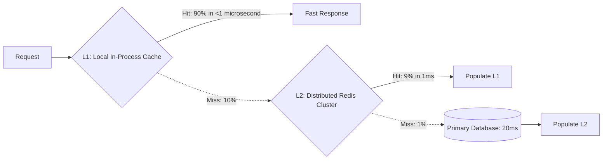

# Multi-Level Caching (L1/L2) Architecture

## 1. Multi-Tiered Latency Hierarchy
Multi-level caching combines the microsecond speed of in-process local memory with the centralized capacity of a distributed cluster:

---

## 2. The L1 Cache Invalidation Challenge
When Pod A mutates data, Pod B's local in-process cache becomes stale.
* **Redis Pub/Sub Invalidation Bus**: When Pod A writes to DB, it publishes an invalidation event (`DEL user:123`) to a shared Redis Pub/Sub channel.
* All microservice pods subscribe to the channel and immediately evict the key from their local L1 memory.
