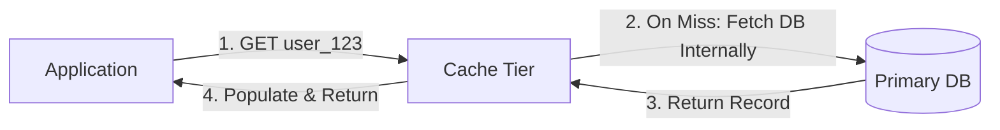

# Read-Through Caching Pattern

## 1. The Transparent Read Abstraction
In Read-Through caching, the application interacts exclusively with the cache interface. The cache library or proxy encapsulates all logic to fetch missing records from the underlying datastore.

---

## 2. Advantages & Architectural Fit
* **Simplified Application Code**: Business logic does not contain repetitive `if (cache == null)` boilerplate.
* **Provider Encapsulation**: Ideal when utilizing enterprise caching middleware (e.g., NCache, Hazelcast, AWS DAX for DynamoDB).
