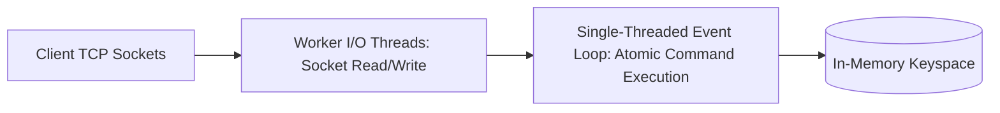

# Redis Internal Architecture

## 1. The Single-Threaded Core Advantage
Redis executes command processing on a **single execution thread** using a non-blocking I/O event multiplexer (`epoll` on Linux).
* **Zero Context Switching**: Eliminates thread context switches and CPU cache thrashing.
* **Lock-Free Operations**: All primitives (`INCR`, `HSET`, `LPUSH`) execute with atomic guarantees without mutex locking.
* *Threaded I/O (Redis 6.0+)*: Network socket reads and writes are offloaded to background I/O threads, while command execution remains strictly single-threaded.

---

## 2. Persistence Engines: RDB vs. AOF

| Feature | RDB (Redis Database Snapshot) | AOF (Append-Only File) |
| :--- | :--- | :--- |
| **Mechanism** | Point-in-time binary snapshot via `fork()` Copy-On-Write. | Continuous append-only transaction log of every write. |
| **Recovery Speed** | Fast (compact binary image reloaded into RAM). | Slower (must replay every individual write statement). |
| **Data Loss Risk** | Higher (loses writes since last snapshot, e.g. 5–15 mins). | Minimal (configured with `fsync everysec`: max 1s loss). |
| **Performance Overhead** | Heavy CPU/memory fork overhead during snapshot. | Continuous disk write I/O overhead. |
