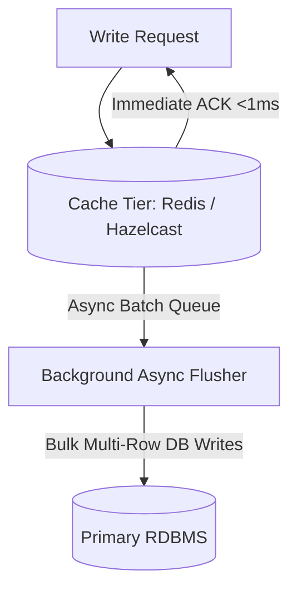

# Write-Behind (Write-Back) Caching Pattern

## 1. Asynchronous Write Persistence
In Write-Behind caching, the application writes directly to the in-memory cache, which acknowledges success immediately. The cache then asynchronously buffers, batches, and flushes mutations to the database in background worker threads.

---

## 2. Extreme Throughput vs. Data Loss Risk
* **Throughput Benefit**: Achieves write speeds exceeding $100,000\text{ writes/sec}$ by transforming random disk I/O into asynchronous bulk batches.
* **Fatal Hazard**: **Permanent Data Loss**. If the cache node crashes before flushing dirty pages to persistent storage, in-flight transactions are permanently lost.
* *Production Fit*: Ideal for non-critical high-frequency updates: video game leaderboards, IoT sensor telemetry, social media view counts.
