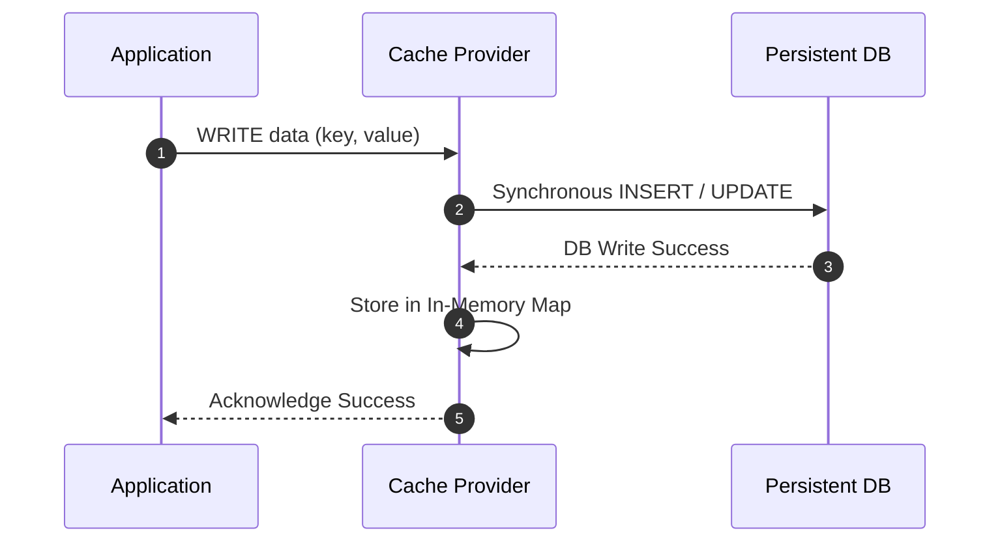

# Write-Through Caching Pattern

## 1. Synchronous Cache-and-Store Mutation
In Write-Through caching, the application writes directly to the cache. The cache synchronously writes through to the persistent datastore before returning success to the client.

---

## 2. Trade-offs
* **Advantage**: Guaranteed cache freshness; data in cache is never stale.
* **Disadvantage**: High write latency (incurs the round-trip penalty of both cache and persistent disk write).
