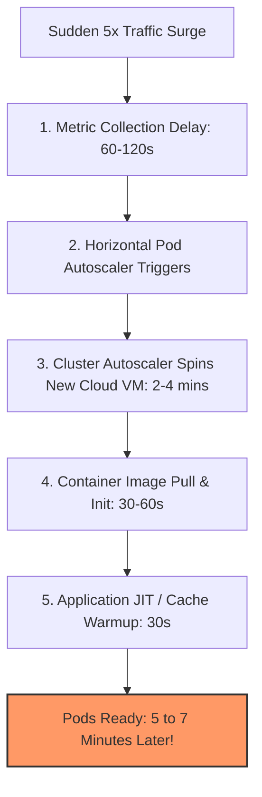
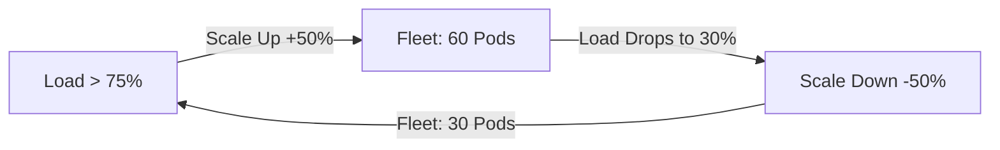

# Autoscaling Capacity Planning

## 1. Principles of Elastic Infrastructure
Autoscaling dynamically adjusts provisioned compute resources to match fluctuating demand. While autoscaling enables cost efficiency during off-peak hours, naive implementations cause production outages due to provisioning latency, metric lag, and oscillatory flapping.

---

## 2. Provisioning Latency & Spin-up Math
The time elapsed between a traffic surge and effective traffic absorption is governed by:
$$T_{\text{spinup}} = T_{\text{detect}} + T_{\text{node\_launch}} + T_{\text{image\_pull}} + T_{\text{app\_warmup}}$$

### Spin-up Latency by Compute Paradigm
* **Serverless Functions (AWS Lambda / Cloud Functions)**: $T_{\text{spinup}} \approx 100\text{ ms}\text{--}2\text{ s}$. Fast, but limited execution duration and high per-invocation cost at scale.
* **Containers on Warm Kubernetes Nodes**: $T_{\text{spinup}} \approx 15\text{--}45\text{ seconds}$.
* **New Cloud Virtual Machines (EC2 / Azure VMs)**: $T_{\text{spinup}} \approx 2\text{--}5\text{ minutes}$.

*Critical Architectural Rule*: Autoscaling **cannot** absorb sudden flash crowds (e.g., ticket drops or marketing push notifications) arriving in $<15\text{ seconds}$. Flash surges must be absorbed by pre-warmed capacity headroom and queue buffering.

---

## 3. Preventing Autoscaling Flapping (Oscillation)
Flapping occurs when a cluster rapidly scales up under load, cools down immediately, scales down, and then spikes again, causing continuous container initialization churn.

### Flapping Mitigation Policies
1. **Asymmetric Cooldowns**:
   * Scale-up stabilization window: $0\text{ seconds}$ (scale up instantly when breached).
   * Scale-down stabilization window: $300\text{--}600\text{ seconds}$ (hold capacity for 5–10 minutes to verify traffic drop is real).
2. **Step Scaling Policies**:
   * If CPU $>70\%$: Add $+20\%$ pods.
   * If CPU $>85\%$: Add $+50\%$ pods.
   * If CPU $>95\%$: Add $+100\%$ pods (emergency surge).
3. **Minimum Safe Fleet Sizing**:
   $$N_{\text{min}} = \frac{\text{Projected Steady Baseline Traffic}}{\text{Safe Pod Capacity}} \times 1.25\text{ Headroom}$$
