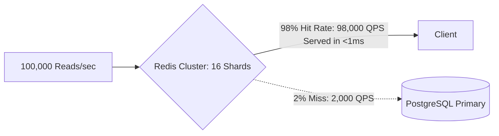

# Cache Capacity Planning

## 1. Principles of Distributed Cache Sizing
Distributed caching tiers (Redis Cluster, Memcached) serve as high-speed shock absorbers for persistence layers. Sizing cache capacity requires determining working set memory, network interface card (NIC) throughput, cluster shard distribution, and serialization overhead.

---

## 2. Working Set & Memory Layout Math

### Memory Formula
$$\text{RAM}_{\text{cache}} = (N_{\text{items}} \times S_{\text{item\_raw}} \times M_{\text{engine\_overhead}}) \times \text{RF} \times (1 + M_{\text{headroom}})$$

Where:
* $M_{\text{engine\_overhead}}$: Redis data structures (`dict`, `robj`, `sds`) add $30\%\text{--}50\%$ memory overhead over raw payload bytes.
* $\text{RF}$: Replication factor (typically 2: 1 Primary + 1 Replica per shard).
* $M_{\text{headroom}}$: Safety buffer for `BGSAVE` copy-on-write fork operations ($25\%\text{--}30\%$).

---

## 3. Network Bandwidth Sizing for In-Memory Clusters
Redis nodes are frequently bottlenecked by **Network Bandwidth** long before memory or CPU is exhausted.

### Cache Bandwidth Formula
$$\text{BW}_{\text{cache}} = \text{QPS}_{\text{node}} \times S_{\text{item}} \times 8\text{ bits/byte}$$

#### Example:
* A single Redis shard serving $40,000\text{ GET requests/sec}$ with an average item size of $10\text{ KB}$:
$$\text{BW}_{\text{node}} = 40,000 \times 10,000\text{ bytes} \times 8 = 3,200,000,000\text{ bps} = 3.2\text{ Gbps}$$
* *Architecture Constraint*: Standard cloud VM instances capped at 5 Gbps network will saturate. Sizing requires sharding across multiple smaller nodes to distribute network interface traffic.

---

## 4. Eviction Architecture & Production Gotchas
* **Memory Headroom for Snapshotting**: When Redis executes a background snapshot (`BGSAVE`) or replica synchronization, Linux utilizes Copy-On-Write (COW). Heavy write traffic during snapshotting can double memory usage, triggering OOM panics if memory headroom is under $30\%$.
* **Cluster Sharding Partition Limits**: Redis Cluster divides keyspace into $16,384$ hash slots using CRC16:
  $$\text{Slot} = \text{CRC16}(\text{key}) \pmod{16384}$$
* Distribute hash slots uniformly across shards; utilize hash tags (`{tenant_123}:order_456`) to ensure co-located keys hash to the same shard for multi-key operations.
