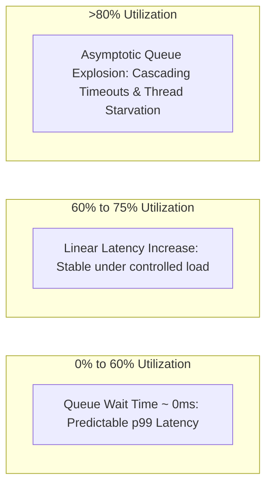
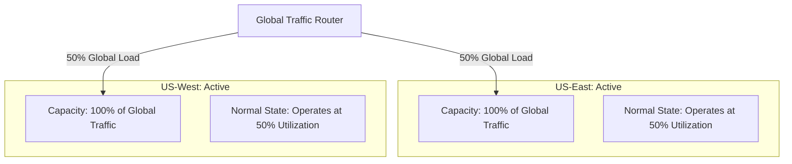

# Capacity Headroom & Safety Buffers

## 1. The Queueing Theory of Headroom
In computer systems, waiting times follow Queueing Theory ($M/M/c$ multi-server queue models). As resource utilization ($\rho$) approaches $1.0$ ($100\%$), queue lengths and request latencies do not scale linearly; they explode exponentially.

---

## 2. Mathematical Modeling of Sizing Headroom

### Utilization Factor ($\rho$)
$$\rho = \frac{\lambda}{c \times \mu}$$
Where:
* $\lambda$ = Arrival rate (RPS)
* $c$ = Number of worker instances / threads
* $\mu$ = Service rate per worker

### Target Maximum Utilization Ceilings
To prevent entering the exponential knee of the curve:
* **Compute (CPU)**: $\rho \le 0.65$ ($65\%$ maximum sustained target).
* **Application Memory**: $\rho \le 0.70$ ($70\%$ maximum to avoid Linux OOM kill).
* **Database IOPS**: $\rho \le 0.60$ ($60\%$ to allow WAL sync bursts).
* **Storage Capacity**: $\rho \le 0.75$ ($75\%$ to allow LSM compaction and VACUUM headroom).

---

## 3. Failure Headroom: The Multi-Region 2N Model

In Tier-0 mission-critical enterprise systems, headroom must absorb complete datacenter or cloud region disasters without degrading performance.

### Complete Disaster Shift
If Region 1 suffers a total power grid failure:
1. DNS shifts $100\%$ of global traffic to Region 2.
2. Region 2 utilization rises from $50\%$ to **$100\%$ capacity** (its designed physical ceiling).
3. System survives with **zero customer degradation and zero emergency autoscaling lag**.
