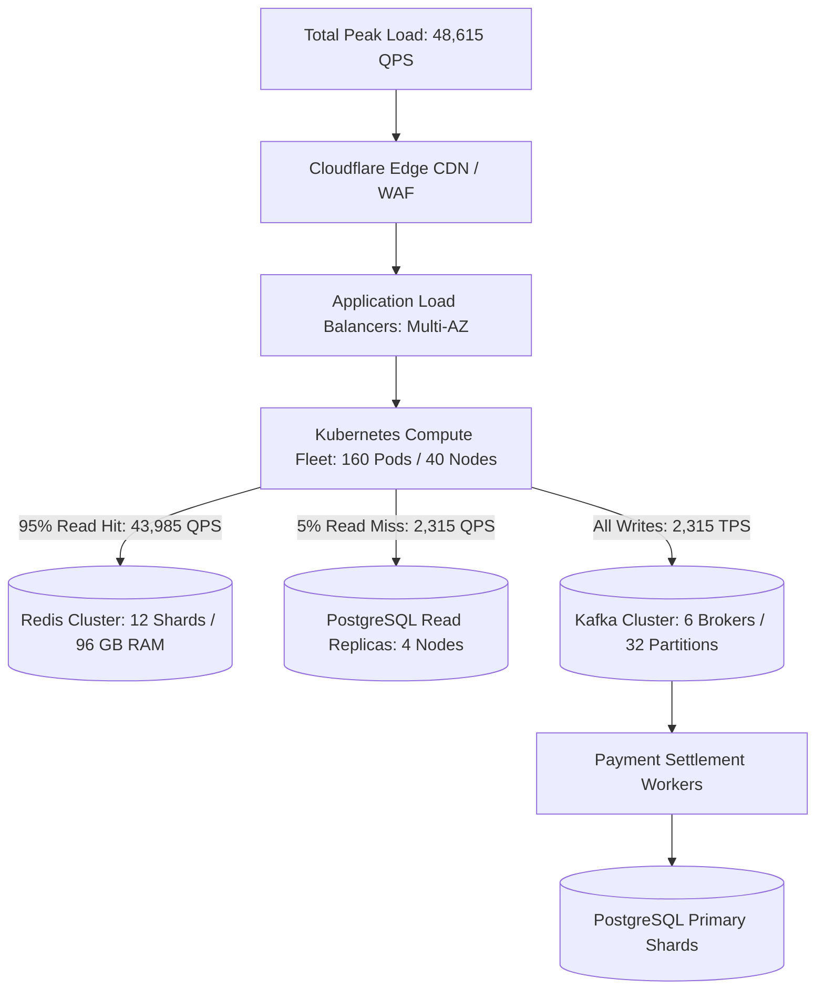

# Enterprise Capacity Planning Example: Tier-1 Neobank Platform

## 1. System Context & Business Profile
This worked example models an enterprise-grade digital banking and payment platform operating across multi-region active-active cloud infrastructure.

* **Registered Accounts**: $20,000,000$ accounts.
* **Daily Active Users (DAU)**: $5,000,000\text{ users/day}$ ($25\%$ stickiness).
* **Average Daily Transactions**: 4 transactions per active user per day.
* **Total Daily Transactions**: $20,000,000\text{ transactions/day}$.
* **Average Ingress RPS**:
  $$\text{RPS}_{\text{avg}} = \frac{20,000,000}{86,400} \approx 231.5\text{ transactions/sec}$$
* **Peak Surge Multiplier**: Peak lunchtime and pay-day surge factor of **$10\times$**:
  $$\text{RPS}_{\text{peak}} = 231.5 \times 10 \approx 2,315\text{ write transactions/sec}$$
* **Read-to-Write Ratio**: $20:1$ (account balance queries, transaction history browsing):
  $$\text{Peak Read QPS} = 2,315 \times 20 \approx 46,300\text{ read QPS}$$
  $$\text{Total Ingress Peak QPS} = 2,315 + 46,300 \approx 48,615\text{ QPS}$$

---

## 2. Complete Architecture Bill of Materials (BOM)

---

## 3. Mathematical Sizing by Subsystem

### 1. Compute Tier (Kubernetes Fleet)
* An optimized Go/gRPC payment microservice processes $300\text{ RPS per vCPU}$.
* Targeting $60\%$ CPU utilization ceiling:
  $$\text{Safe RPS per Core} = 300 \times 0.60 = 180\text{ RPS per vCPU}$$
* Total vCPUs required:
  $$\text{vCPUs} = \frac{48,615\text{ peak QPS}}{180} \approx 270\text{ vCPUs}$$
* Provisioning on 8-vCPU / 32GB RAM worker nodes:
  $$\text{Nodes Required} = \frac{270}{8} \approx 34\text{ nodes}$$
* Adding $20\%$ N+2 resilience headroom $\rightarrow$ **40 Kubernetes Worker Nodes**.

---

### 2. In-Memory Cache Tier (Redis Cluster)
* **Working Set**: Cache account balance & auth tokens for active users ($5,000,000\text{ DAU}$).
* **Payload Size**: $500\text{ bytes}$ per cached user profile.
* **Raw RAM**: $5,000,000 \times 500\text{ bytes} = 2.5\text{ GB}$.
* Adding $1.5\times$ Redis metadata overhead + $2\times$ replication + $30\%$ headroom:
  $$\text{RAM}_{\text{cluster}} = 2.5\text{ GB} \times 1.5 \times 2 \times 1.30 \approx 9.75\text{ GB RAM}$$
* *Network Bandwidth Sizing*: Serving $44,000\text{ QPS} \times 500\text{ bytes} \times 8 = 176\text{ Mbps}$.
* Provisioned as **6 Shards** (each 1 Master + 1 Replica with 8 GB RAM nodes) for HA and failover isolation.

---

### 3. Database Persistence Tier (PostgreSQL)
* **Write Throughput**: $2,315\text{ TPS}$ peak.
* Relational ACID write with WAL, secondary indexes, and audit logs generates $6\times$ write IOPS amplification:
  $$\text{Peak Write IOPS} = 2,315 \times 6 \approx 13,890\text{ IOPS}$$
* Sized on AWS provisioned IOPS SSD (`io2`) with **$25,000\text{ IOPS}$** to ensure $<1\text{ ms}$ write latency during peak bursts.
* **5-Year Storage Projection**:
  $$20,000,000\text{ tx/day} \times 365 \times 5\text{ years} = 36.5\text{ Billion transaction records}$$
  $$36.5 \times 10^9 \times 400\text{ bytes/row} \times 1.4\text{ (Index)} \times 2\text{ (Replica)} \approx 40.8\text{ TB}$$
* Partitioned by `account_id` and date range with automated archiving of records $>90\text{ days}$ to AWS S3 Parquet.
