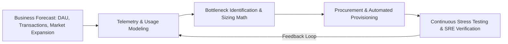
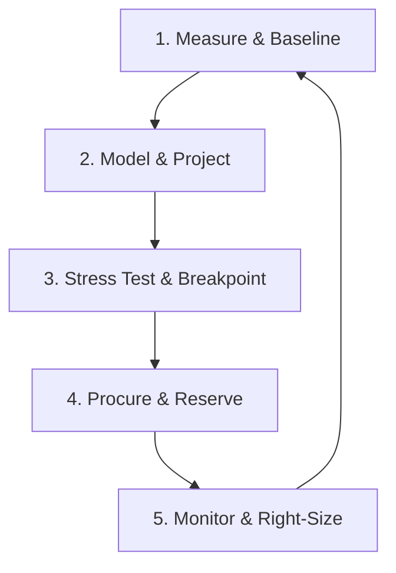

# Capacity Planning Overview

## 1. Executive Summary & Purpose
Capacity planning is the strategic engineering discipline of forecasting, modeling, procuring, and allocating infrastructure resources (compute, memory, persistent storage, network bandwidth, and managed cloud services) to satisfy business growth while upholding Service Level Objectives (SLOs) and optimizing Total Cost of Ownership (TCO). In Fortune 500 and large global enterprises, capacity planning bridges business revenue targets and physical cloud infrastructure limits.

---

## 2. The Five Dimensions of Infrastructure Capacity
Every distributed system is constrained by five fundamental physical and logical resources:

| Resource Dimension | Primary Metrics | Failure Threshold | System Collapse Symptom |
| :--- | :--- | :--- | :--- |
| **Compute** | vCPU utilization, Thread run queues, Context switches | $>70\%$ sustained CPU | Thread pool starvation, HTTP 504 gateway timeouts. |
| **Memory** | Resident Set Size (RSS), JVM Heap, Buffer cache | $>75\%$ physical RAM | Linux kernel OOM-killer terminating processes, GC stop-the-world pauses. |
| **Storage IO** | IOPS, I/O Queue Depth, Write latency | $>60\%$ disk saturation | Disk write lock timeouts, replication lag runaway. |
| **Storage Volume** | Usable GB/TB, Inode counts, WAL log allocation | $>80\%$ disk space | Database flips to read-only mode, LSM compaction freezes. |
| **Network** | Egress/Ingress Gbps, Packets Per Second (PPS), Sockets | $>60\%$ NIC / NAT limit | TCP retransmissions, SYN packet drops, connection resets. |

---

## 3. The Continuous Capacity Lifecycle

1. **Measure & Baseline**: Extract high-cardinality utilization metrics from Prometheus/Datadog across all service tiers.
2. **Model & Project**: Apply statistical time-series forecasting (Holt-Winters, Prophet) coupled with business step-function events.
3. **Stress Test & Breakpoint**: Subject staging/pre-prod systems to load testing until failure to locate the architectural "knee of the curve."
4. **Procure & Reserve**: Convert steady-state baseline load into 1-year or 3-year cloud Savings Plans / Reserved Instances (30–60% OpEx savings).
5. **Monitor & Right-Size**: SRE and FinOps teams continuously eliminate orphaned storage volumes, zombie pods, and over-provisioned memory limits.

---

## 4. Key Performance Indicators (KPIs)
* **Capacity Headroom Factor ($H$)**:
  $$H = \frac{\text{Stress-Tested Maximum Sustainable RPS}}{\text{Current Peak RPS}} \quad (\text{Target: } H \ge 2.0\text{ to } 3.0)$$
* **Resource Saturation Index ($S_r$)**:
  $$S_r = \max(\text{Util}_{\text{cpu}}, \text{Util}_{\text{mem}}, \text{Util}_{\text{iops}}, \text{Util}_{\text{net}})$$
* **Unit Cost of Delivery**:
  $$\text{Unit Cost} = \frac{\text{Total Monthly Infrastructure Spend}}{\text{Total Monthly Billable Transactions}}$$
