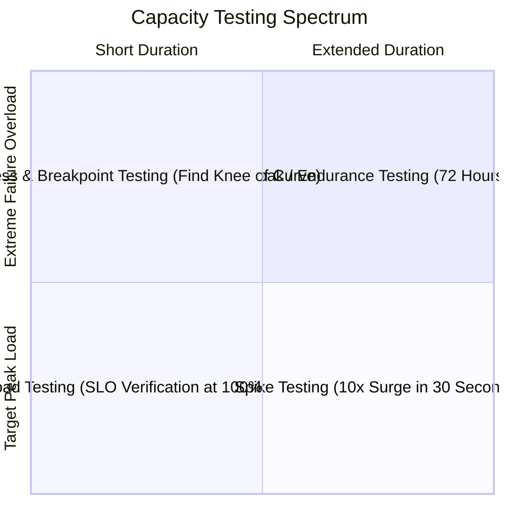

# Capacity Testing & Workload Verification

## 1. The Capacity Testing Taxonomy
Theoretical capacity models must be validated through rigorous empirical testing. Systems fail in production because synthetic calculations omit real-world variables such as lock contention, garbage collection stop-the-world pauses, and network socket exhaustion.

---

## 2. Core Testing Methodologies

### 1. Load Testing
* **Purpose**: Verify system satisfies all latency and throughput SLOs under $100\%$ of projected peak load.
* **Duration**: 2 to 4 hours of sustained peak traffic.
* **Pass Criteria**: $p99 \text{ Latency} < 100\text{ ms}$, Error rate $< 0.01\%$.

### 2. Stress & Breakpoint Testing
* **Purpose**: Ramp traffic linearly past $100\%$ until the system collapses, identifying the primary bottleneck (CPU, DB locks, or socket limits).
* **Pass Criteria**: System degrades gracefully (returns HTTP 429 Too Many Requests via rate limiting) rather than crashing into 500/504 errors.

### 3. Soak (Endurance) Testing
* **Purpose**: Run sustained $70\%\text{--}80\%$ load continuously for 48 to 72 hours.
* **Crucial for Detecting**:
  * Memory leaks (slow JVM heap growth, uncollected Node.js event listeners).
  * Database connection leaks (connections not returned to pool on error paths).
  * Disk space exhaustion from unrotated logs or unpurged temporary tables.

### 4. Spike Testing
* **Purpose**: Instantaneously inject $5\times\text{--}10\times$ load within 15 seconds to evaluate autoscaler and rate-limiting responsiveness.

---

## 3. Tooling & Distributed Workload Architecture
* **k6 / Locust / Gatling**: Modern, code-defined distributed load generation engines.
* **Test Environment Parity**: Capacity tests executed in miniature staging environments ($10\%$ scale) produce invalid conclusions due to non-linear network and database locking physics. Run tests in full production-scale staging environments or dark-launch traffic in production.
