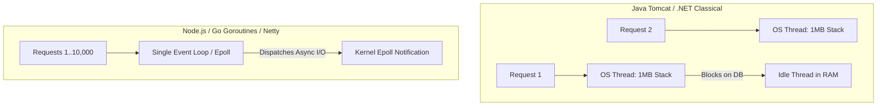

# Compute Capacity Planning

## 1. Principles of Compute Capacity
Compute capacity planning governs the allocation of virtual CPUs (vCPU), physical cores, execution threads, and container runtime resources. Sizing compute requires distinguishing between **CPU-bound workloads** (cryptography, JSON parsing, video encoding) and **I/O-bound workloads** (database queries, network RPCs, file streaming).

---

## 2. Sizing Models & Equations

### Throughput per Core Equation
$$\text{RPS}_{\text{core}} = \frac{1}{\text{CPU Execution Time per Request (seconds)}} \times \text{Core Efficiency Factor}$$

If an average API request requires $12\text{ ms}$ ($0.012\text{ s}$) of dedicated CPU crunching:
$$\text{Max Theoretical RPS}_{\text{core}} = \frac{1}{0.012} \approx 83.3\text{ RPS per core}$$

Targeting a safe **$60\%$ CPU utilization ceiling** to avoid exponential queueing delay:
$$\text{Safe Sustainable RPS}_{\text{core}} = 83.3 \times 0.60 \approx 50\text{ RPS per core}$$

### Fleet Sizing Formula
$$\text{Total Required vCPUs} = \frac{\text{Projected Peak Ingress RPS}}{\text{Safe Sustainable RPS}_{\text{core}}} \times \text{Resilience Headroom (N+1 / 2N)}$$

---

## 3. Concurrency Runtime Models: Threads vs. Asynchronous Event Loops

### Memory Footprint per Execution Unit
* **OS Native Thread (Java/C++)**: Allocates $1\text{ MB}$ stack memory (`-Xss1m`). $5,000$ concurrent threads consume $\approx 5\text{ GB RAM}$ purely in stack space, inducing heavy kernel context switching.
* **Go Goroutine**: Starts at $2\text{ KB}$ initial stack size. $50,000$ goroutines consume $\approx 100\text{ MB RAM}$.
* **Java Virtual Threads (Project Loom)**: Lightweight carrier threads managed at user space, scaling concurrency to $10^5+$ active connections.

---

## 4. Garbage Collection (GC) Overhead Modeling
In managed runtimes (JVM, .NET, Go), allocation rates dictate GC pause frequencies:
$$\text{Allocation Rate} = \text{RPS} \times \text{Allocated Bytes per Request}$$
* If a service processes $10,000\text{ RPS}$ and allocates $50\text{ KB}$ of short-lived objects per request:
$$\text{Heap Churn} = 10,000 \times 50\text{ KB} = 500\text{ MB/second}$$
* *Architecture Rule*: Always provision **$2\times\text{--}3\times$ the active heap footprint** as headroom to keep JVM young-generation collection cycles under $5\text{ ms}$ and avoid catastrophic Stop-the-World (STW) pauses.
