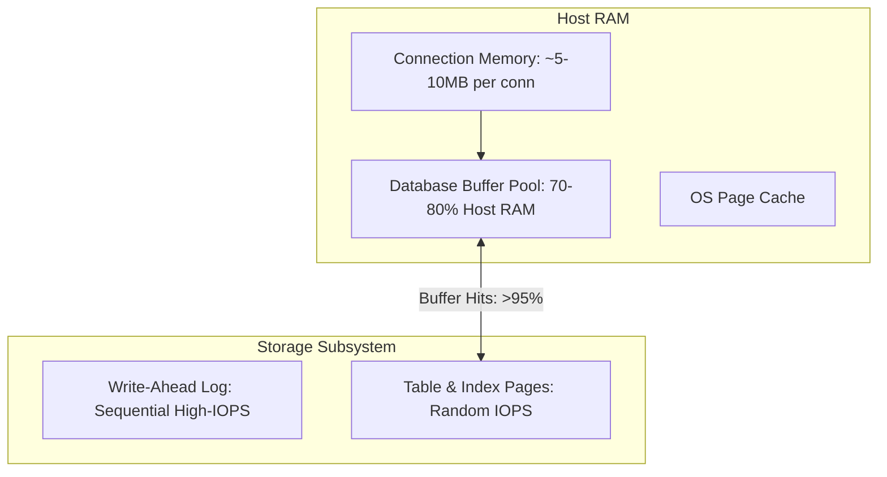

# Database Capacity Planning

## 1. The Persistence Tier Constraint
The database is almost always the hardest component to scale horizontally in any enterprise system. While compute nodes can be scaled out in seconds via autoscaling groups, databases involve state, consistency guarantees, transaction boundaries, and disk I/O limits.

---

## 2. Storage & Memory Sizing Blueprint

### 1. Buffer Pool Sizing (Working Set Rule)
To achieve sub-millisecond read responses, the active working set of table and index pages must reside in the database buffer pool (`shared_buffers` in PostgreSQL, `innodb_buffer_pool_size` in MySQL):
$$\text{RAM}_{\text{buffer\_pool}} \ge \text{Total Active Indexes} + \left(\text{Total Active Table Rows} \times 0.20\right)$$
*Rule of thumb*: If the database working set exceeds host RAM, disk paging begins and read latency degrades from $0.5\text{ ms}$ to $15\text{ ms}$.

### 2. Disk IOPS Capacity Modeling
$$\text{IOPS}_{\text{read}} = \text{QPS}_{\text{read}} \times (1 - \text{Hit Ratio}_{\text{cache}}) \times \text{Pages Scanned}$$
$$\text{IOPS}_{\text{write}} = \text{QPS}_{\text{write}} \times (1 + N_{\text{indexes}} + \text{WAL IOPS})$$

---

## 3. Connection Sizing & The Saturation Cliff
A single database connection consumes memory ($5\text{--}10\text{ MB}$ per backend process in PostgreSQL) and contends for CPU scheduling. 

### Sizing Equation (HikariCP / PostgreSQL Standard)
$$\text{Connections}_{\text{max}} = (\text{CPU Cores} \times 2) + \text{Disk Spindle / Channel Count}$$
* For a 16-vCPU instance:
$$\text{Connections}_{\text{max}} = (16 \times 2) + 1 = 33\text{ connections}$$
* To service thousands of upstream microservice instances, deploy an out-of-process connection multiplexer like **PgBouncer** or **AWS RDS Proxy**, funneling 5,000 client sockets into a pool of 32 physical database sessions.

---

## 4. Sharding & Partitioning Triggers
Plan for horizontal database sharding when any of the following boundaries are approached:
1. **Total Disk Footprint**: Exceeds $3\text{--}4\text{ TB}$ per single instance.
2. **Sustained Write Throughput**: Exceeds $20,000\text{ write IOPS}$.
3. **Table Row Counts**: Individual tables exceed $50\text{ Million}$ rows, causing B-Tree index depths to reach 4 levels.
