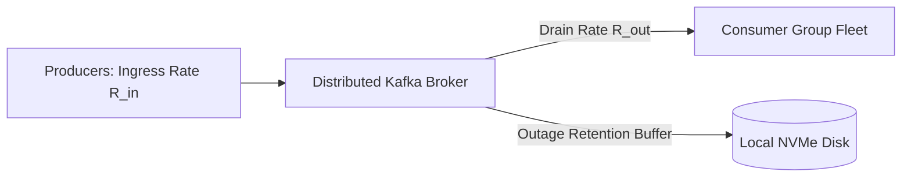

# Message Queue Capacity Planning

## 1. Role in Enterprise Architecture
Message brokers and distributed streaming platforms (Apache Kafka, RabbitMQ, AWS SQS) provide asynchronous decoupling, traffic smoothing, and event-driven choreography. Sizing queue capacity guarantees that downstream processing outages do not cause upstream message rejection or broker collapse.

---

## 2. Mathematical Sizing Blueprint

### 1. Ingress & Disk Write Throughput
$$\text{Disk Throughput (MB/s)} = \text{Messages/sec} \times \text{Avg Message Size (MB)} \times \text{RF}$$
* For $50,000\text{ msgs/sec}$ of $1\text{ KB}$ payload with Replication Factor $\text{RF} = 3$:
$$\text{Disk Throughput} = 50,000 \times 0.001\text{ MB} \times 3 = 150\text{ MB/s}$$

### 2. Disk Storage Retention Sizing
$$\text{Storage}_{\text{queue}} = \text{Throughput}_{\text{raw}} \times T_{\text{retention\_seconds}} \times \text{RF} \times (1 + M_{\text{slack}})$$
* Sizing for 7 days retention ($604,800\text{ seconds}$):
$$\text{Storage}_{\text{raw}} = 50\text{ MB/s} \times 604,800\text{ s} \approx 30.24\text{ TB}$$
$$\text{Storage}_{\text{replicated}} = 30.24\text{ TB} \times 3 \times 1.25 \approx 113.4\text{ TB}$$

---

## 3. Partition Count & Consumer Concurrency Sizing
In Apache Kafka, **partition count dictates maximum consumer concurrency**. A consumer group cannot have more active consumer instances than partitions in a topic:

$$\text{Partitions}_{\text{min}} = \max\left( \frac{\text{Ingress Throughput (MB/s)}}{10\text{ MB/s}}, \frac{\text{Ingress Events/sec}}{\text{Max Consumer Throughput/sec}} \right)$$

* If single-worker processing capacity is $1,000\text{ events/sec}$, sustaining $50,000\text{ events/sec}$ requires at least:
$$\text{Partitions} = \frac{50,000}{1,000} = 50\text{ partitions}$$
* *Recommendation*: Provision **64 partitions** (power of 2) across 6–8 brokers.

---

## 4. Backlog Catch-Up Math
If downstream consumers fail for 4 hours, messages accumulate:
$$\text{Backlog Messages} = 50,000\text{ msgs/s} \times (4 \times 3600\text{ s}) = 720,000,000\text{ messages}$$
If consumer fleet recovers and scales up to drain at $75,000\text{ msgs/s}$ (while live traffic continues at $50,000\text{ msgs/s}$):
$$\text{Net Drain Rate} = 75,000 - 50,000 = 25,000\text{ msgs/s}$$
$$T_{\text{recovery}} = \frac{720,000,000}{25,000} = 28,800\text{ seconds} = 8\text{ hours}$$
