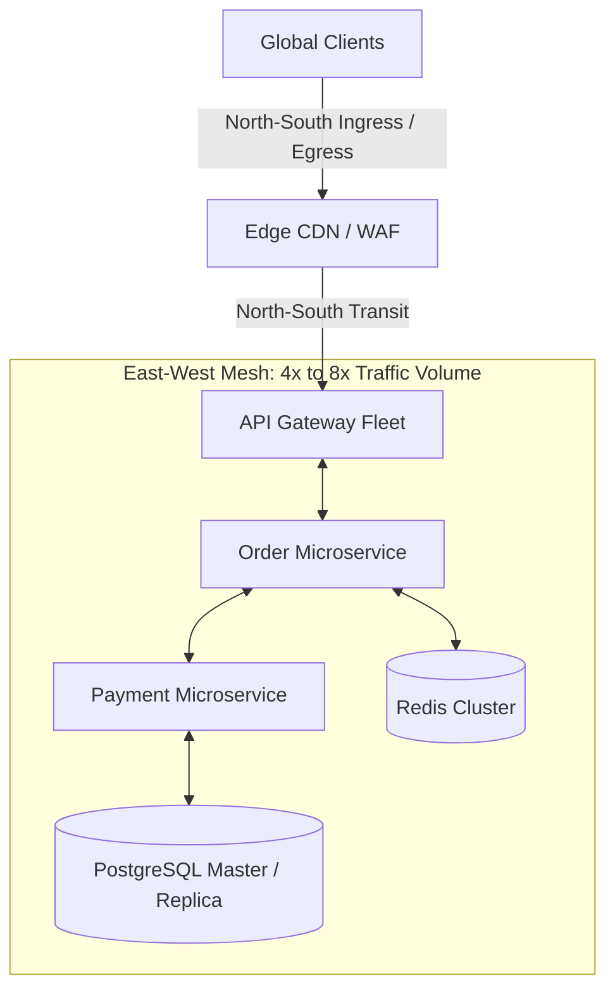

# Network Capacity Planning

## 1. Network Topology & Traffic Flows
Distributed cloud architectures separate network traffic into two distinct vectors:
* **North-South Traffic**: Traffic entering from the internet through CDNs, DDoS scrubbers, and edge Application Load Balancers into microservice gateways.
* **East-West Traffic**: Internal service-to-service RPCs, distributed database replication, cache synchronization, and telemetry logs circulating within the VPC mesh.

---

## 2. Mathematical Bandwidth & PPS Equations

### Total Required Network Bandwidth
$$\text{BW}_{\text{total}} = \left( \text{QPS}_{\text{ingress}} \times S_{\text{ingress}} + \text{QPS}_{\text{egress}} \times S_{\text{egress}} \right) \times 8 \times M_{\text{east-west}}$$

Where:
* $M_{\text{east-west}}$ = East-West amplification multiplier (typically $3.0\text{--}8.0\times$ in microservice fabrics).

### Packets Per Second (PPS) Bottlenecks
Network interfaces are constrained not only by raw gigabits per second, but by the physical capacity of the hypervisor to process individual packet headers:
$$\text{PPS} = \frac{\text{Bandwidth (Bytes/sec)}}{\text{Average Packet Size (Bytes)}}$$
* *The Micro-Packet Trap*: A service transmitting $500\text{ MB/s}$ of large $64\text{ KB}$ video chunks generates $\approx 7,800\text{ PPS}$ (trivially processed). The same $500\text{ MB/s}$ sent as tiny $128\text{ byte}$ IoT telemetry packets generates **$3,900,000\text{ PPS}$**, completely exhausting cloud hypervisor interrupt queues and dropping packets despite using only a fraction of physical NIC bandwidth.

---

## 3. Cloud Provider Network Limits & FinOps Hazards

| Bottleneck / Constraint | Hard Physical Ceiling | Mitigation Architecture |
| :--- | :--- | :--- |
| **Cloud VM NIC Bandwidth** | 10 Gbps – 100 Gbps per instance | Scale out across multiple smaller instances; enable Enhanced Networking (SR-IOV / ENA). |
| **Managed NAT Gateway** | 45 Gbps per NAT gateway instance | Split traffic across multiple subnets/NAT gateways; utilize VPC Endpoints for S3/DynamoDB. |
| **Cross-AZ Data Transfer** | $\$0.01\text{ / GB}$ in each direction | Enforce AZ-affinity in service mesh routing; co-locate high-bandwidth consumers with producers. |
| **Inter-Region Data Egress** | $\$0.02\text{--}\$0.05\text{ / GB}$ | Compress cross-region Kafka mirrors with Zstandard; batch non-urgent replication updates. |
