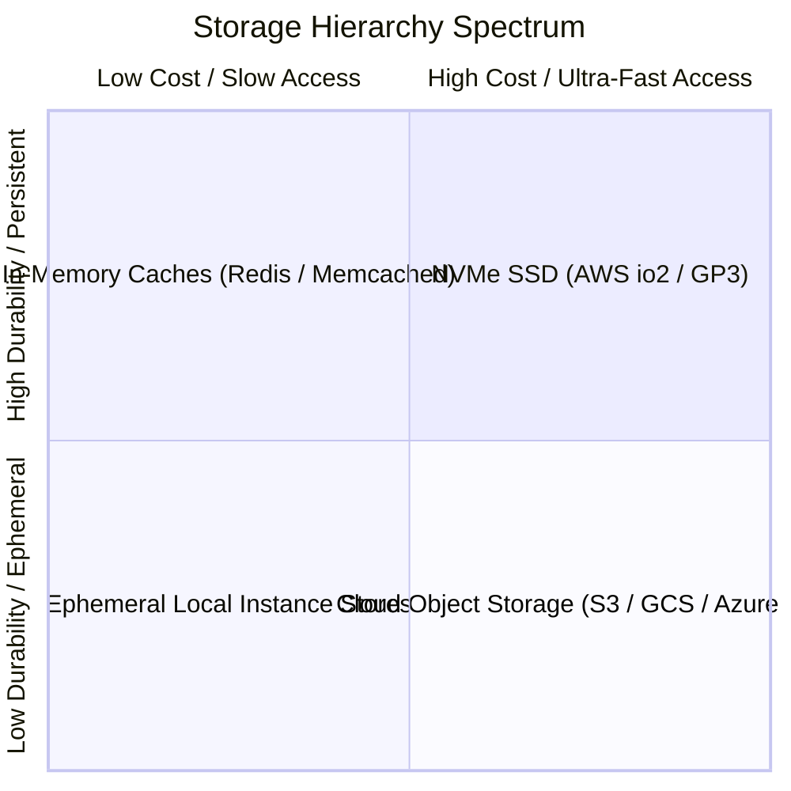

# Storage Capacity Planning

## 1. Storage Media Classification
Enterprise storage capacity planning spans diverse physical and logical media, balancing cost per gigabyte against I/O latency and throughput.

---

## 2. Mathematical Modeling of Multi-Year Storage

### Cumulative Growth Formula
$$\text{Total Storage}_T = \int_0^T \text{Ingestion Rate}(t) \, dt + \text{Baseline Storage}_0$$
Under constant compound growth rate $r$:
$$\text{Storage}(Y) = \text{Storage}_0 \times (1 + r)^Y$$

### Storage Volume Multipliers
$$\text{Physical Disks Required} = \frac{\text{Logical Raw Data} \times (1 + M_{\text{indexes}}) \times \text{RF}}{(1 - M_{\text{filesystem\_slack}}) \times \text{Erasure Coding Ratio}}$$

---

## 3. Comparative Economics of Storage Tiers

| Tier | Storage Type | Read Latency | Durability (SLA) | Cost / TB / Month | Use Case |
| :--- | :--- | :--- | :--- | :--- | :--- |
| **Hot** | Provisioned IOPS NVMe SSD | $<1\text{ ms}$ | 99.999% | $\$125.00$ | Active transactional DBs. |
| **Warm** | Standard Cloud SSD (gp3) | $1\text{--}5\text{ ms}$ | 99.9% | $\$80.00$ | Search indices, Kafka logs. |
| **Cool** | Cloud Object Store Standard | $20\text{--}100\text{ ms}$ | 99.999999999% | $\$23.00$ | Media assets, backups. |
| **Cold** | Infrequent Access Object | $50\text{--}200\text{ ms}$ | 99.999999999% | $\$12.50$ | 90-day historical data. |
| **Archive**| Deep Glacier / Tape | 3–12 hours | 99.999999999% | $\$0.99$ | 7-year regulatory compliance. |

---

## 4. Production Storage Constraints & Inode Exhaustion
* **POSIX Inode Depletion**: Every file or directory on a Linux filesystem requires one inode. Storing 100 million miniature files ($<1\text{ KB}$) exhausts inodes when disk space is only $10\%$ utilized. Use object stores or pack small files into aggregate sequence files/Parquet blocks.
* **RAID / Erasure Coding Overhead**: 
  * Traditional RAID 10 requires $2\times$ raw disk capacity.
  * Modern Erasure Coding (e.g., $8+4$ parity) achieves 11 nines durability with only $1.5\times$ storage overhead.
