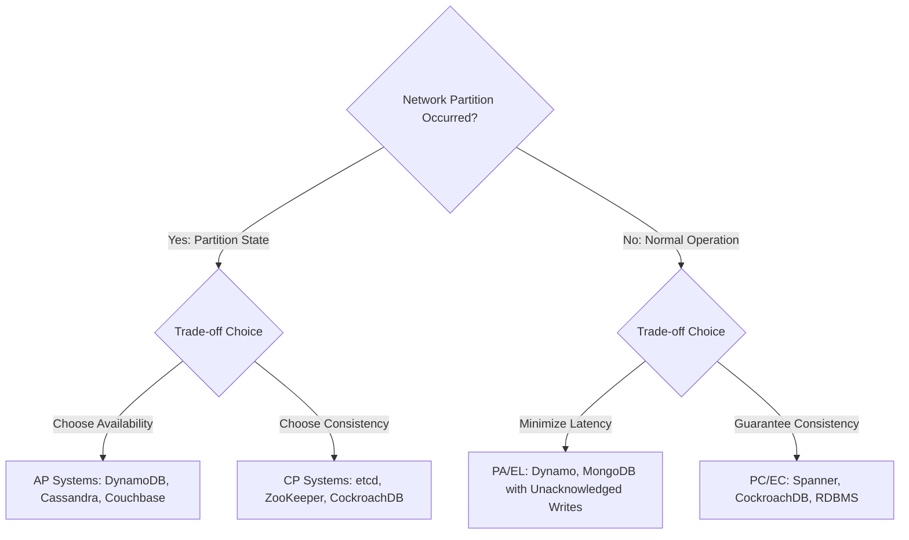

# Distributed Consistency Models: CAP, PACELC, and Conflict Resolution

## 1. Architectural Overview & Context
In single-node systems, consistency is straightforward: ACID transactions guarantee immediate, global consistency via hardware memory barriers and disk serialization.

In distributed systems, data must be replicated across independent nodes to survive hardware outages and network partitions. The speed of light ($c \approx 300,000\text{ km/s}$) and the inevitability of network latency make instantaneous global consistency impossible. System architects must explicitly choose a **Consistency Model** that balances correctness, latency, and availability.

---

## 2. The Spectrum of Consistency Models

Consistency is not a binary choice between "Strong" and "Eventual"; it is a continuous spectrum:

```
STRICTEST (Highest Latency, Lowest Availability)
  ▲
  │  1. Linearizable (External consistency, global wall-clock ordering)
  │  2. Sequential Consistency (All nodes see same sequence of writes)
  │  3. Causal Consistency (Causally related writes preserved in order)
  │  4. Read-Your-Writes (Client always sees its own previous updates)
  │  5. Monotonic Reads (Client never sees state rewind backwards in time)
  │  6. Eventual Consistency (If no new updates occur, all replicas converge)
  ▼
WEAKEST (Lowest Latency, Highest Availability)
```

### Detailed Consistency Model Definitions:

| Consistency Model | Formal Guarantee | Architectural Use Case | Latency & Performance Impact |
|---|---|---|---|
| **Linearizability (Strict Consistency)** | Every read returns the value of the most recent write in real time across the entire cluster. | Financial double-entry ledgers, unique user registration, cluster leader election (Raft / etcd). | High. Requires cross-node synchronous consensus (paxos/raft) and read-repair or leader leases. |
| **Causal Consistency** | If operation B was caused by operation A, all nodes observe A before B. Concurrent operations may be seen in different order. | Social media comments, threaded collaborative messaging (Slack, Teams). | Moderate. Vector clocks track causality without locking unaffected keys. |
| **Read-Your-Writes** | A client that writes value $X$ is guaranteed that subsequent reads by that same client will always observe $X$ or newer. | User profile updates, e-commerce cart modifications. | Low-to-Moderate. Directs reads to the primary node for a sticky session buffer (e.g. 5 seconds) after a write. |
| **Monotonic Reads** | Once a client reads state version $V$, it will never observe an older version $< V$ on subsequent reads. | Timeline scrolling, activity feed polling. | Low. Pins client connections to replicas with replication lag $\le$ previously observed timestamp. |
| **Eventual Consistency** | All replicas will eventually converge to the same value in the absence of new mutations. | Product catalog views, high-velocity analytics counters, DNS caching. | Ultra-Low. Writes acknowledge locally; replication occurs asynchronously in background. |

---

## 3. CAP vs. PACELC Theorems

While the classic **CAP Theorem** (Consistency, Availability, Partition Tolerance) focuses exclusively on behavior *during a network partition*, the **PACELC Theorem** (Abadi, 2012) describes distributed behavior during normal operation as well:

$$\text{If } \mathbf{P} \text{ (Partition): } [\mathbf{A} \text{ vs } \mathbf{C}] \quad \mathbf{E} \text{lse: } [\mathbf{L} \text{ (Latency) vs } \mathbf{C} \text{ (Consistency)}]$$



---

## 4. Quorum Consensus Mathematics

For leaderless distributed datastores (e.g. Apache Cassandra, AWS DynamoDB), consistency is configured per-request using **Quorum Mathematics**:

$$R + W > N$$

Where:
* $N$ = Total replication factor (number of nodes storing a copy of the partition).
* $W$ = Number of replicas that must acknowledge a write before returning success.
* $R$ = Number of replicas that must be queried on a read operation.

```
       Write Quorum (W = 2)             Read Quorum (R = 2)
       ┌──────────────────┐             ┌──────────────────┐
       │  Node 1 (v2)     │             │  Node 2 (v2)     │
       │  Node 2 (v2)     │ ◄──Overlap─►│  Node 3 (v1)     │
       └──────────────────┘             └──────────────────┘
       [ Node 3 (v1) ]                  [ Node 1 (v2) ]
```

* **Strong Consistency ($R + W > N$)**: The read set and write set are mathematically guaranteed to intersect at at least one node containing the latest write version.
* **Low Latency Reads ($R = 1, W = N$)**: Reads return immediately from any local node, but writes must wait for all nodes.
* **Low Latency Writes ($W = 1, R = N$)**: Writes acknowledge immediately, but reads must query all nodes to detect the latest version.

---

## 5. Distributed Conflict Resolution Strategies

When eventual consistency allows concurrent writes to the same key on different nodes:

### 5.1. Last-Write-Wins (LWW)
* Resolves conflicts based on the highest physical wall-clock timestamp.
* **Critical Danger**: Vulnerable to server clock drift (NTP skew). A node with a clock ahead by 200ms will silently overwrite newer writes, causing permanent, silent data loss.

### 5.2. Conflict-Free Replicated Data Types (CRDTs)
* Mathematically provable data structures that converge deterministically without locks or central coordinators:
  * **Pn-Counters**: Distributed increment/decrement counters (e.g., inventory counts).
  * **LWW-Element-Set**: Sets with deterministic add/remove tombstone resolution.

### 5.3. Two-Phase Commit (2PC) vs. Saga Pattern
```
2PC (Atomic, Blocking, Fragile)                  Saga (Eventually Consistent, Non-blocking)
┌─────────────────────────────────┐              ┌─────────────────────────────────┐
│ Coordinator locks all databases │              │ Execute Local Tx 1              │
│ Prepare phase → Commit phase    │              │ ──► Publish Event               │
│ Single slow node blocks cluster │              │   ──► Execute Local Tx 2        │
│ Vulnerable to coordinator crash │              │ (If failure: Compensating Tx 1) │
└─────────────────────────────────┘              └─────────────────────────────────┘
```

---

## 6. Consistency Architecture Checklist
- [ ] Explicitly classify data attributes into Strong Consistency vs Eventual Consistency domains.
- [ ] Enforce $R + W > N$ quorum settings on all critical financial and identity datastores.
- [ ] Eliminate Last-Write-Wins (LWW) on financial balances and counters; use CRDTs or Saga choreography.
- [ ] Implement sticky session routing to guarantee Read-Your-Writes for authenticated user sessions.
- [ ] Avoid Two-Phase Commit (2PC) across high-latency WAN or cross-cloud boundaries.
- [ ] Monitor replication lag ($\Delta t$) as a primary operational Service Level Indicator.

---

## 7. Related Modules
* [06-data/](../../06-data/) — Storage engines, caching invalidation, and data governance.
* [02-system-design/availability/](../availability/README.md) — High availability tradeoffs and error budgets.
* [14-enterprise-integration/reconciliation/](../../14-enterprise-integration/reconciliation/) — Financial break management and ledger reconciliation.
