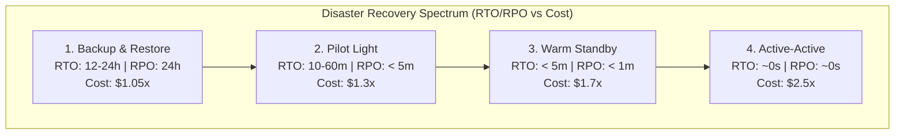

# Disaster Recovery (DR) Architecture: RTO, RPO, and Multi-Region Strategies

## 1. Architectural Overview & Context
**Disaster Recovery (DR)** is the comprehensive set of policies, tools, and technical procedures that enable an enterprise to resume mission-critical operations following natural catastrophes, catastrophic cloud provider outages, cyberattacks (e.g., ransomware), or human operational errors.

DR design begins with a foundational principle:
> **Availability is surviving component failure within a region; Disaster Recovery is surviving the total loss of an entire region or data center.**

---

## 2. Core Metrics: RPO and RTO Formulation

All DR strategies are evaluated against two fundamental business and architectural constraints:

```
Normal Operation           Disaster Hits (t = 0)                   Systems Restored
═════════════════════════════════╤═════════════════════════════════════════╤══════►
                  │              │                                         │
                  ◄──────────────►                                         │
                  Recovery Point Objective (RPO)                           │
                  [Maximum Acceptable Data Loss]                           │
                                 │                                         │
                                 ◄─────────────────────────────────────────►
                                 Recovery Time Objective (RTO)
                                 [Maximum Acceptable Downtime]
```

### Mathematical Definitions:
* **Recovery Point Objective (RPO)**: The maximum acceptable age of data that can be permanently lost when disaster strikes.
  $$\text{RPO} = t_{\text{disaster}} - t_{\text{last\_valid\_backup\_or\_replication}}$$
  * *RPO = 0*: Zero data loss allowed. Requires synchronous multi-AZ/cross-region writes.
  * *RPO = 15 mins*: Acceptable to lose the last 15 minutes of transactional data.
* **Recovery Time Objective (RTO)**: The maximum acceptable duration of clock time between disaster declaration and full service restoration.
  $$\text{RTO} = t_{\text{service\_restored}} - t_{\text{disaster\_declared}}$$

---

## 3. The 4 Cloud Disaster Recovery Strategies



| Strategy | RPO | RTO | Primary Mechanism | Cost Multiplier | Typical Enterprise Workload |
|---|---|---|---|---|---|
| **1. Backup & Restore** | $12 - 24\text{ hours}$ | $12 - 24\text{ hours}$ | Nightly automated snapshots to immutable cross-region object storage; Terraform rebuilds VPC on disaster. | $1.05\times$ | Internal dev/staging environments, non-critical HR/batch systems. |
| **2. Pilot Light** | $< 5\text{ minutes}$ | $10 - 30\text{ minutes}$ | Core database replicates continuously to secondary region. Web/app servers are off (AMIs ready); auto-scaling groups scale from 0 to N on disaster. | $1.3\times - 1.5\times$ | Standard enterprise portals, back-office operations. |
| **3. Warm Standby** | Seconds | $< 5\text{ minutes}$ | Secondary region runs a continuous, down-scaled production replica (e.g. 20% capacity). Scales to 100% capacity instantly upon DNS reroute. | $1.6\times - 1.8\times$ | Customer-facing e-commerce, core SaaS products. |
| **4. Multi-Region Active-Active** | Near-Zero ($\approx 0$) | Zero ($< 1\text{s}$) | Both regions serve 50% live production traffic continuously. Anycast DNS reroutes traffic instantly on regional outage. | $2.2\times - 3.0\times$ | Core banking ledgers, healthcare telemetry, payment gateways. |

---

## 4. Multi-Region Data Replication Mechanics

```
Primary Region (us-east-1)                        Secondary DR Region (us-west-2)
┌─────────────────────────┐                       ┌─────────────────────────┐
│ Master Database (RW)    │                       │ Read Replica (RO)       │
│   ├── Commit Transaction│                       │   ├── Apply WAL stream  │
│   └── Write-Ahead Log   │ ────Replication Stream│   └── Standby for promo │
└────────────┬────────────┘      (Async WAN)      └────────────▲────────────┘
             │                                                 │
             └────── Automated Health Check Ping Fail ─────────┘
                                       │
                      [Split-Brain Prevention / Fencing]
```

### The Split-Brain Dilemma & Fencing Tokens
If network communication breaks between Region 1 and Region 2, Region 2 might falsely conclude Region 1 is dead and promote its read replica to primary while Region 1 is still accepting writes.
* **Catastrophic Consequence**: Both regions accept independent writes, causing irreconcilable database divergence.
* **Architectural Mitigation**: Enforce an external third-party witness (e.g., Cloudflare Anycast or AWS Route 53 health check) to issue a cryptographic **Fencing Token**. Region 2 cannot promote to RW without acquiring the lease token.

---

## 5. Automated DR Testing: Game Days & Chaos Engineering

A disaster recovery plan that has not been executed in the last 6 months is an illusion:

1. **Automated Non-Disruptive Failover Drills**:
   * Execute read replica promotions in an isolated sandbox VPC using production database snapshots weekly.
2. **Chaos Engineering (AWS Fault Injection Service / Chaos Mesh)**:
   * Periodically sever cross-region VPC peering or simulate total AZ blackouts in staging to verify that auto-remediation scripts trigger as expected.
3. **Runbook Automation**:
   * Replace 50-page PDF runbooks with executable automation scripts (Terraform, Ansible, AWS Systems Manager Automation Documents) that require only a single human confirmation to execute failover.

---

## 6. Disaster Recovery Architectural Checklist
- [ ] Establish formal RTO and RPO targets approved by executive business leadership.
- [ ] Replicate all database snapshots and backups to a separate cloud account with immutable Object Lock (WORM) enabled.
- [ ] Enforce automated Infrastructure as Code (IaC) to rebuild all networking, compute, and ingress routes from scratch.
- [ ] Implement fencing tokens to prevent split-brain dual-write corruption during network partitions.
- [ ] Ensure application connection strings support automatic DNS failover or multi-host connection retry parameters.
- [ ] Conduct a minimum of two scheduled production Disaster Recovery Game Days per calendar year.

---

## 7. Related Modules
* [01-architecture/cloud-architecture/](../../01-architecture/cloud-architecture/README.md) — Cloud landing zones, VPC transit hubs, and workload placement.
* [02-system-design/availability/](../availability/README.md) — Availability math, Nines table, and active-active topologies.
* [19-case-studies/](../../19-case-studies/) — Real-world outage analyses, postmortems, and architectural lessons learned.
