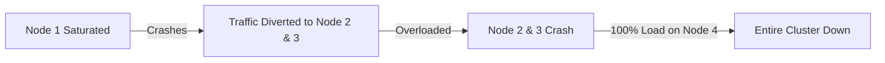
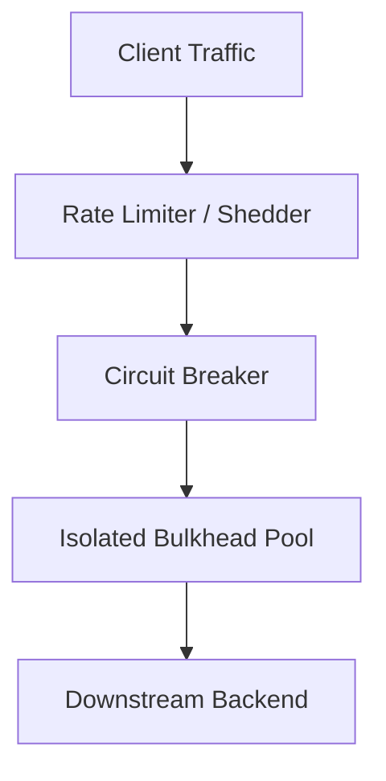

# Cascading Failures in Distributed Systems

## 1. Architectural Anatomy of a Cascade

A cascading failure occurs when a localized failure in a single component increases load on neighboring components, triggering a progressive, self-reinforcing chain reaction that brings down the entire distributed topology.

---

## 2. Common Triggering Mechanisms

1. **Resource Saturation & Failover Spikes**: If 1 of 5 identical nodes crashes, the remaining 4 immediately absorb 25% extra traffic. If they were already operating at 85% capacity, they immediately collapse in sequence.
2. **Cascading Timeout Queueing**: Upstream services wait for lagging downstream services. Upstream worker threads become blocked, filling thread pools until the upstream service runs out of memory or connections.
3. **Database Connection Pool Starvation**: When slow queries hold open database connections, application servers queue incoming requests until web servers drop all traffic.

---

## 3. Engineering Defense Blueprint

- **Circuit Breakers**: Trip to open state when error rates or latency cross thresholds, returning immediate errors or cached fallbacks instead of sending requests downstream.
- **Bulkheads**: Isolate thread pools and connection resources so that a slowdown in one external integration cannot exhaust threads needed for other features.
- **Load Shedding**: Drop low-priority traffic (e.g., background indexing) at the API gateway when CPU or queue depth exceeds 80%.
