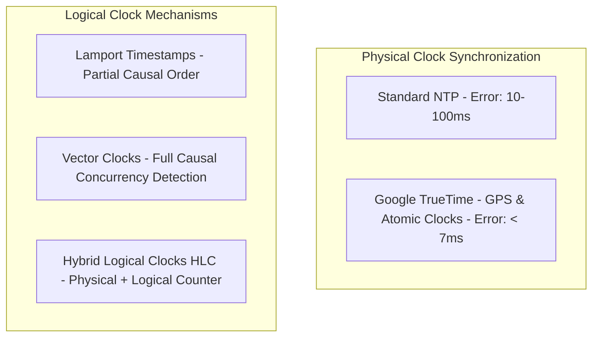

# Clock Drift & Distributed Time

## 1. The Myth of Synchronized Time

In distributed systems, physical quartz clocks on different servers drift continuously due to temperature fluctuations, hardware aging, and CPU voltage variance (typically drifting 5–20 milliseconds per day).

Network Time Protocol (NTP) synchronizes clocks over the internet, but NTP itself is subject to network jitter, packet drops, and asymmetric routing delays. Therefore: **Physical timestamps cannot be trusted to establish strict causal ordering across independent distributed servers.**

---

## 2. Failures Caused by Clock Drift

- **Last-Write-Wins (LWW) Data Loss**: In Cassandra or Riak, if Server A's clock is 500ms ahead of Server B, Server A's stale update can silently overwrite Server B's newer update because its timestamp is artificially larger.
- **Token Expiration Inconsistencies**: JWT tokens or leases generated on one machine are rejected as already expired on another.

---

## 3. Engineering Solutions

### A. Hybrid Logical Clocks (HLC)
Combines physical system time with a logical tick counter:
- Monotonically increases even if physical clock drifts backwards.
- Used in modern distributed SQL engines (CockroachDB, YugabyteDB) to achieve causal consistency without atomic hardware.

### B. Google TrueTime (Spanner)
Google deployed GPS receivers and rubidium atomic clocks in every datacenter:
- TrueTime API returns an interval: $[t_{\text{earliest}}, t_{\text{latest}}]$ with uncertainty $\epsilon \le 7\text{ms}$.
- To ensure linearizability: A transaction waits $2\epsilon$ before committing, guaranteeing that any future transaction globally receives a strictly higher timestamp.
