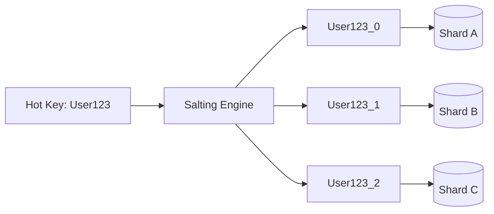

# Hotspot Management in Distributed Systems

## 1. Problem Definition

A hotspot occurs when traffic, storage, or computational load is distributed non-uniformly across a cluster, concentrating severe demand onto a single node, shard, or partition while remaining resources sit idle.

---

## 2. Common Root Causes

- **Poor Shard Key Selection**: Sharding an e-commerce database by `country_code` routes 80% of European traffic to the `DE` or `UK` shard.
- **Celebrity / Influencer Entities**: In a social network, querying a user with 50 million followers places extreme read/write pressure on whichever partition hosts that user's record.
- **Temporal Keys**: Sharding by auto-incrementing timestamps (`created_at`) forces 100% of current writes onto the latest partition.

---

## 3. Architectural Mitigations

### A. Salted Shard Keys
Append a randomized salt or bounded hash suffix (e.g., `user_id + "_" + rand(0, 9)`):
- Writes are uniformly dispersed across 10 distinct shards.
- Reads for aggregations execute a lightweight scatter-gather query across the 10 salted sub-keys.

### B. Multi-Level Caching for Hot Keys
Place near-cache / in-memory local caches (Guava/Caffeine) on application servers for viral keys. The application serves millions of reads from process RAM, shielding the database cluster entirely.
