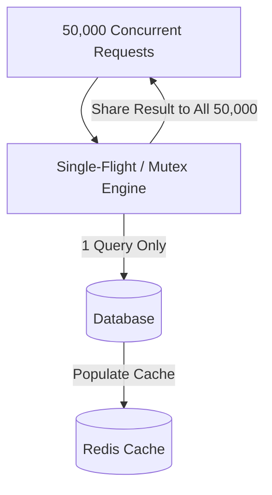

# Thundering Herd Problem

## 1. Problem Definition

The Thundering Herd problem occurs when a large number of concurrent processes, threads, or client requests simultaneously wake up or rush to acquire a single resource, recalculate an expired cache entry, or query an overloaded database, causing resource exhaustion and system collapse.

---

## 2. Common Manifestations

- **Cache Stampede on Expiration**: A heavily read key (e.g., home page catalog with 50,000 QPS) expires. Within milliseconds, 50,000 requests miss the cache simultaneously and all execute the identical heavy query against the database.
- **Process Awakening on Event**: Hundreds of worker threads blocked on a single socket or event semaphore all awaken when one event arrives; one thread consumes it while the remaining 999 waste CPU in context switching.

---

## 3. Architectural Defense Patterns

### A. Distributed Mutex / Single-Flight Pattern
When a cache miss occurs, the application attempts to acquire a distributed lock for that specific key. Only the thread that acquires the lock queries the database and updates the cache. All other threads wait and read the refreshed cache value once the lock is released.

### B. Probabilistic Early Expiration (XFetch Algorithm)
Instead of waiting for the key to expire, clients calculate a probability of early refreshing based on the compute cost $\Delta$ and remaining TTL $\beta$:
$$e^{-\frac{\text{TTL}}{\beta \cdot \Delta}} > \text{random}()$$
As TTL approaches zero, background workers proactively recompute and refresh the cache before it ever expires for public readers.

### C. Randomized Cache Jitter
Add random variance to TTLs ($TTL = 3600 \pm \text{rand}(0, 300)$) to prevent keys created at the same time from expiring in synchronized waves.
