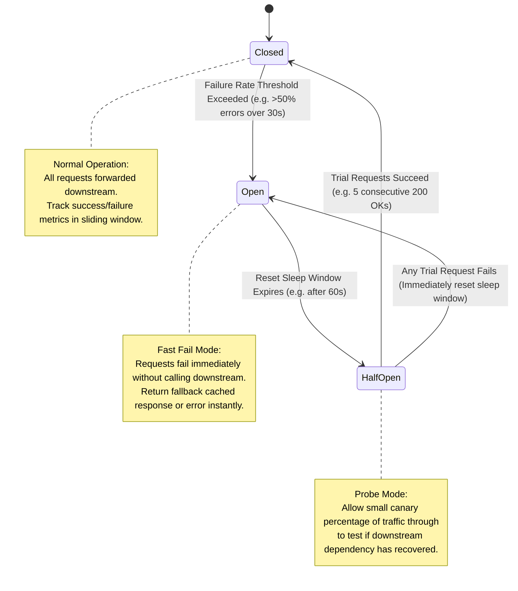

# Fault Tolerance & Resilience Architecture: Patterns, State Machines, and Jitter

## 1. Architectural Overview & Context
**Fault Tolerance** is the architectural property that enables a distributed system to continue operating properly in the event of the failure of one or more of its constituent components.

A foundational reality of distributed systems is summarized by Werner Vogels:
> *"Failures are a given and everything will eventually fail over time."*

Resilient architectures do not attempt to construct un-failable components; they architect the blast radius so that local failures do not trigger catastrophic **cascading failures** that bring down the entire enterprise.

---

## 2. The Circuit Breaker Pattern & State Machine

When a downstream dependency (e.g. legacy ERP or external payment gateway) suffers an outage, continued synchronous requests exhaust caller thread pools and crash upstream services. A **Circuit Breaker** isolates the failing dependency.



---

## 3. Retries, Exponential Backoff, and Full Jitter

Blind retries are a leading cause of self-inflicted Distributed Denial of Service (**Thundering Herd / Retry Storms**). When a service stutters, thousands of simultaneous callers retry at the exact same interval, compounding the overload.

### The Mathematics of Decorrelated Full Jitter:
Rather than fixed retries ($t = 1\text{s}, 2\text{s}, 4\text{s}$), callers must introduce randomized entropy (jitter):

$$t_{\text{sleep}} = \text{random}\left(0, \, \min(t_{\text{max}}, \, t_{\text{base}} \times 2^{\text{attempt}})\right)$$

```python
import time
import random
import requests

def call_with_exponential_backoff_and_jitter(url: str, max_retries: int = 4, base_delay: float = 0.5, max_delay: float = 8.0):
    for attempt in range(max_retries):
        try:
            response = requests.get(url, timeout=2.0)
            if response.status_code < 500:
                return response
        except (requests.exceptions.Timeout, requests.exceptions.ConnectionError):
            pass
            
        if attempt == max_retries - 1:
            raise RuntimeError(f"All {max_retries} attempts failed for {url}")
            
        # Full Jitter calculation
        backoff_ceiling = min(max_delay, base_delay * (2 ** attempt))
        sleep_duration = random.uniform(0, backoff_ceiling)
        time.sleep(sleep_duration)
```

---

## 4. Bulkhead Isolation & Failure Domains

Borrowed from naval architecture, a **Bulkhead** divides a system into isolated compartments. If one compartment fills with water (crashes), the remaining compartments remain buoyant.

```
Without Bulkhead (Shared Thread Pool)             With Bulkhead (Isolated Compartments)
┌───────────────────────────────────────┐         ┌───────────────────────────────────────┐
│ Common Worker Thread Pool (100)       │         │ Payment Thread Pool (50 threads)      │
│ ├── 90 threads blocked waiting on     │         │ ├── Handles checkout calls only       │
│ │   slow Third-Party Analytics        │         ├───────────────────────────────────────┤
│ └── 10 threads remaining for Checkout │         │ Analytics Thread Pool (15 threads)    │
│ [Result: Checkout crashes due to slow │         │ ├── Starves independently; 0 impact on│
│  analytics!]                          │         │     payment threads                   │
└───────────────────────────────────────┘         └───────────────────────────────────────┘
```

---

## 5. Advanced Resilience Patterns

| Pattern | Architectural Mechanism | When to Use |
|---|---|---|
| **Request Hedging** | If a high-priority read request does not respond within the p95 latency ($50\text{ms}$), dispatch an identical second request to another replica and take whichever returns first. | Eliminates tail latency spikes in critical user-facing search and read pipelines. |
| **Load Shedding** | Under severe CPU or queue saturation, reject low-priority traffic (`HTTP 503`) immediately to guarantee high-priority transactions finish successfully. | Preventing node collapse during sudden 10x traffic spikes. |
| **Graceful Degradation** | If personal recommendation engine is down, return a static top-10 products list rather than a broken page. | E-commerce checkout, content portals. |
| **Dead Letter Queue (DLQ)** | Poison pills (malformed payloads that cause consumer crashes) are isolated to a quarantine queue after 3 retries. | Event consumers, streaming message ingestion. |

---

## 6. Fault Tolerance Architectural Checklist
- [ ] Enforce strict connect timeouts ($\le 1000\text{ms}$) and read timeouts ($\le 3000\text{ms}$) on all network calls.
- [ ] Implement Circuit Breakers with configurable error rate thresholds on all external SaaS/COTS APIs.
- [ ] Add randomized full jitter to all exponential backoff retry algorithms.
- [ ] Partition thread pools and connection pools using the Bulkhead pattern.
- [ ] Define static fallback responses (Graceful Degradation) for non-critical downstream failures.
- [ ] Verify resilience mechanics using automated chaos injection in staging environments.

---

## 7. Related Modules
* [02-system-design/availability/](../availability/README.md) — High availability calculations and SLA error budgets.
* [11-observability/](../../11-observability/) — Distributed tracing and synthetic health canary alerts.
* [19-case-studies/](../../19-case-studies/) — Postmortems on cascading failures and retry storm incidents.
