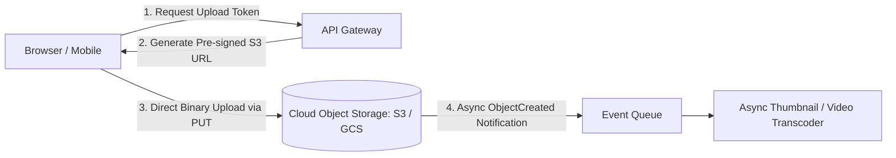

# File & Object Storage Architecture

## 1. Overview & Foundational Principles
Large-scale binary media storage (images, video streams, audio, documents, database backups) requires fundamentally different architectures than structured transactional databases. Storing BLOBs inside relational databases degrades buffer pool hit ratios and explodes backup windows. Modern cloud-native architectures standardize on distributed **Object Storage**.

---

## 2. Storage Media Classification

| Storage Class | Interface / Protocol | Latency | Sizing Unit | Best Fit |
| :--- | :--- | :--- | :--- | :--- |
| **Block Storage** (AWS EBS) | SCSI / NVMe Virtual Disks | Sub-millisecond | Fixed-size Volumes | Transactional databases, OS boot drives. |
| **File Storage** (AWS EFS / NFS) | POSIX / NFS / SMB | Low ($1\text{--}5\text{ ms}$) | Shared Directory Tree | Legacy apps, shared CMS media folders. |
| **Object Storage** (AWS S3) | RESTful HTTP (GET, PUT, DELETE) | Moderate ($20\text{--}80\text{ ms}$) | Flat Key-Value Namespace | Scalable media assets, data lakes, backups. |

---

## 3. Directory Structure
* [Object Storage Architecture](object-storage.md)
* [Block Storage](block-storage.md)
* [File Storage (NFS/EFS)](file-storage.md)
* [AWS S3 Deep-Dive Architecture](s3-architecture.md)
* [Large File Upload Strategies](large-file-upload.md)
* [Multipart Upload Pattern](multipart-upload.md)
* [Resumable Uploads (TUS Protocol)](resumable-upload.md)
* [Chunked Transfer Encoding](chunked-upload.md)
* [Pre-Signed URLs & Direct Uploads](presigned-urls.md)
* [CDN Integration for Media Delivery](cdn-integration.md)
* [Asynchronous File Processing](file-processing.md)
* [Thumbnail Generation Pipeline](thumbnail-generation.md)
* [Content-Addressable Deduplication](deduplication.md)
* [Storage Lifecycle Tiering](storage-tiering.md)
