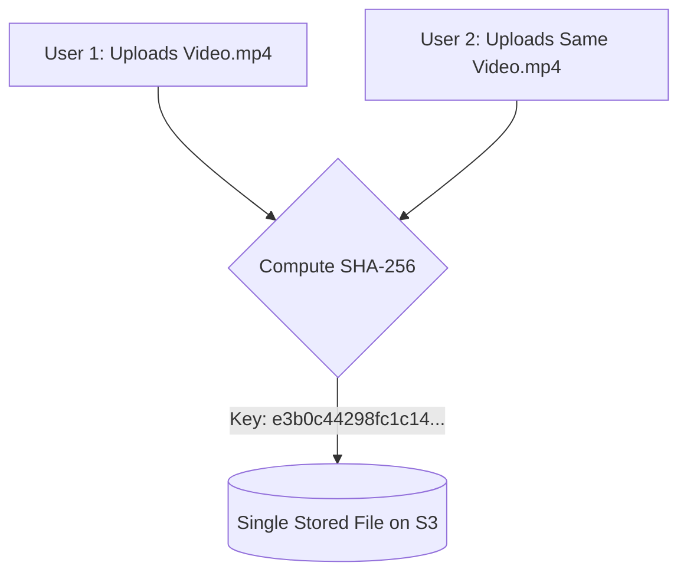

# Content-Addressable Storage (CAS) & Deduplication

## 1. Hash-Based Storage Keys
In Content-Addressable Storage (like Git or Dropbox), the storage key is the cryptographic hash of the file payload:
$$\text{Storage Key} = \text{SHA-256}(\text{File Bytes})$$

* If 1,000 users upload the exact same 1 GB video file, the system stores **1 GB on physical disk** (saving 999 GB of storage!).
