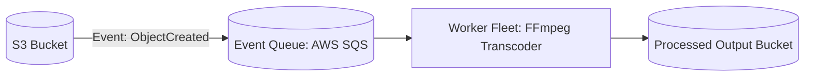

# Asynchronous File Processing Architecture

## 1. Event-Driven Media Pipelines
When an object is uploaded to cloud storage, the bucket automatically emits an `ObjectCreated` event:

```mermaid
flowchart LR
    S3[(S3 Bucket)] -->|Event: ObjectCreated| SQS[(Event Queue: AWS SQS)]
    SQS --> Worker[Worker Fleet: FFmpeg Transcoder]
    Worker --> Output[(Processed Output Bucket)]
```
