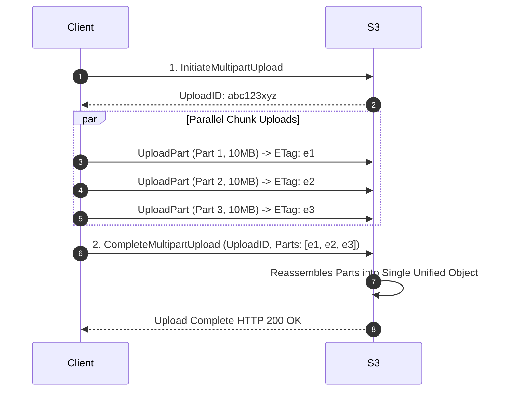

# Multipart Upload Architecture

## 1. Parallel Chunked Upload Protocol
Multipart upload slices large files into discrete chunks ($5\text{ MB}$ to $5\text{ GB}$ per part) uploaded concurrently in parallel:

* If Part 2 fails due to a network glitch, **only Part 2 is retried**; Parts 1 and 3 are preserved!
