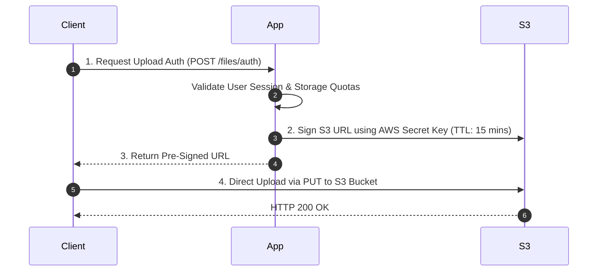

# Pre-Signed URLs Architecture

## 1. Bypassing Origin Application Servers
Routing multi-gigabyte video or image uploads through application servers consumes web worker threads, network bandwidth, and memory. **Pre-Signed URLs** enable direct client-to-storage transfers:

