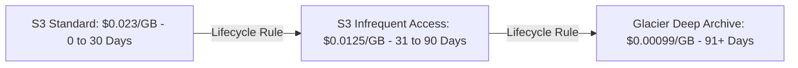

# Storage Lifecycle Tiering Architecture

## 1. Automated Cost Optimization Lifecycle

* **Savings**: Storing 1 Petabyte on S3 Standard costs $\$23,000/\text{month}$. Storing 1 Petabyte on Glacier Deep Archive costs **$\$990/\text{month}$** ($95.7\%$ cost reduction!).
