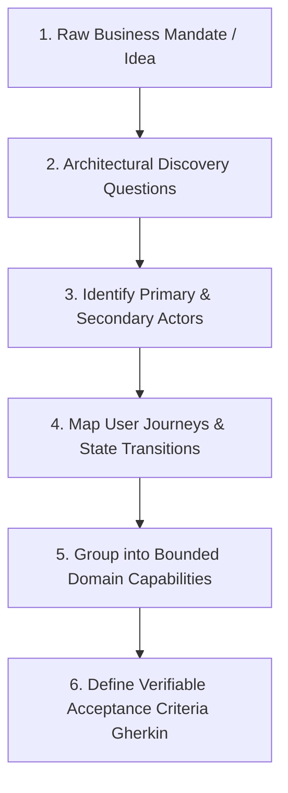
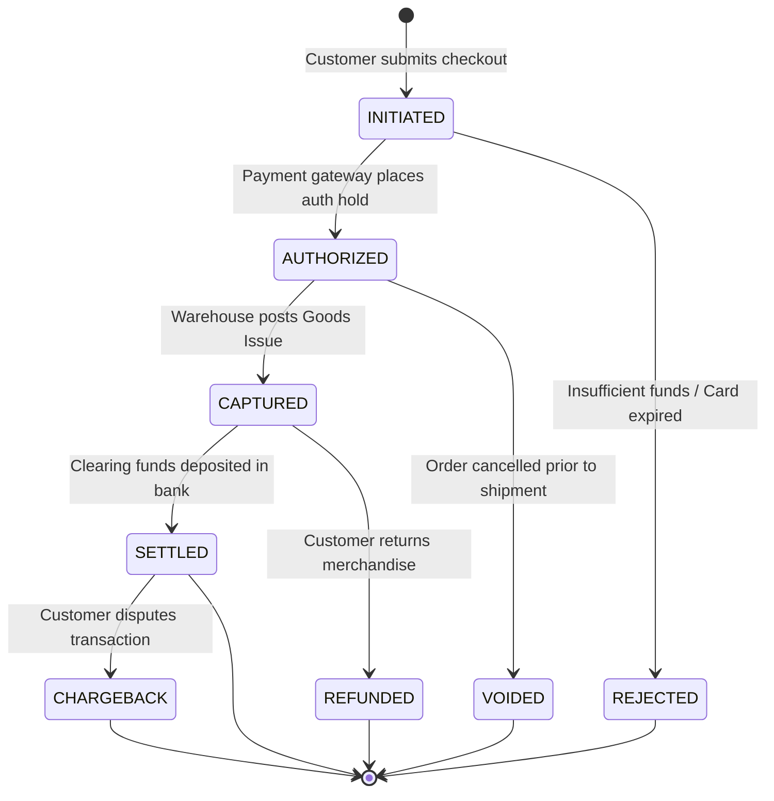

# Functional Requirements: Discovery, Capability Modeling, and Traceability

## 1. Architectural Overview & Context
**Functional Requirements (FRs)** define the specific behaviors, data transformations, domain capabilities, and use cases that a software system must execute to satisfy business goals.

A fatal mistake made by inexperienced architects is jumping directly to technology selection (e.g. "We need Kafka and Kubernetes") before crystallizing what the system actually does. 

> **The Architectural Law of Causality**:
> *Non-Functional Requirements (NFRs) dictate **HOW** a system scales, performs, and recovers; but Functional Requirements (FRs) dictate **WHAT** the system actually computes and **WHY** it exists.*

```
Business Vision & User Needs
             │
             ▼
┌─────────────────────────────────────────────────────────────┐
│             FUNCTIONAL REQUIREMENT DISCOVERY                │
│  User Journeys │ Domain Capabilities │ Business Workflows   │
└────────────────────────────┬────────────────────────────────┘
                             │
            ┌────────────────┴────────────────┐
            ▼                                 ▼
   [Functional Scope (FRs)]          [Quality Attributes (NFRs)]
   - What data is captured?          - How fast must it respond?
   - What states can transition?     - What uptime is required?
   - What business rules apply?      - What data loss is tolerated?
            │                                 │
            └────────────────┬────────────────┘
                             ▼
              [Target Software Architecture]
```

---

## 2. The Requirement Discovery Framework: Ambiguity to Clarity

Architects frequently receive ambiguous executive mandates: *"We need a fast, real-time fraud prevention engine."* 

To convert ambiguity into an actionable architecture:



### The 5 Architectural Discovery Questions:
1. **Who is the actor?** (Human end-user, internal back-office operator, automated batch system, third-party webhook).
2. **What is the trigger?** (User button click, cron schedule, incoming Kafka event, sensor reading).
3. **What is the happy path output?** (Database state change, API response payload, published notification).
4. **What are the exceptional business branches?** (Insufficient funds, expired token, inventory stockout).
5. **What invariants must NEVER be violated?** (Account balance cannot be negative; medical records cannot be deleted).

---

## 3. Domain Capability Modeling & State Machines

Complex functional requirements must be modeled as deterministic finite state machines before database schemas or API endpoints are designed:

### Example: Financial Payment State Machine


---

## 4. Acceptance Criteria Formulation: Gherkin (Given-When-Then)

To prevent miscommunication between Product Owners, Architects, and Implementation Engineers, functional requirements should be formulated with executable behavioral clarity:

```gherkin
Feature: High-Concurrency Flash Sale Inventory Reservation

  Scenario: Successful reservation under stock availability
    Given SKU "IPHONE-15-PRO" has 10 units of available stock in inventory
    When Customer "CUST-101" requests to reserve 2 units with idempotency key "IDEMP-9001"
    Then The inventory reservation must succeed with HTTP 201 Created
    And The remaining available stock for SKU "IPHONE-15-PRO" must equal 8 units
    And An inventory hold must expire automatically in 900 seconds if not checked out

  Scenario: Duplicate reservation request replay (Idempotency)
    Given Customer "CUST-101" previously reserved 2 units with idempotency key "IDEMP-9001"
    When The client resubmits the exact same reservation request with idempotency key "IDEMP-9001"
    Then The system must return the cached HTTP 201 Created response
    And The available stock must NOT be decremented a second time
```

---

## 5. Functional vs. Non-Functional Boundaries

| Dimension | Functional Requirement (FR) | Non-Functional Requirement (NFR) |
|---|---|---|
| **Core Question** | What does the feature do? | How well does the system perform? |
| **Example** | Customer can transfer funds from Checking to Savings account. | Funds transfer API must complete with p99 latency $< 300\text{ms}$ under 5000 TPS load. |
| **Validation Method**| Unit tests, integration tests, user acceptance testing (UAT). | Load testing, chaos testing, penetration testing, DR drills. |
| **Architecture Impact**| Domain entity design, business logic, API contract schemas. | Sharding, caching, clustering, multi-region replication, mTLS. |

---

## 6. Functional Requirements Architectural Checklist
- [ ] Deconstruct ambiguous user requests into bounded business use cases with clear triggers and outputs.
- [ ] Explicitly map all entity lifecycle state machines, identifying valid and invalid transitions.
- [ ] Formulate acceptance criteria using Given-When-Then behavioral specifications.
- [ ] Identify business invariant rules that must be enforced at the database or domain layer.
- [ ] Maintain bidirectional traceability between business requirements, ADRs, and automated test suites.

---

## 7. Related Modules
* [16-architecture-deliverables/](../../16-architecture-deliverables/) — System Architecture Document (SAD), High-Level Design (HLD), and Low-Level Design (LLD).
* [20-interview-system-design/](../../20-interview-system-design/) — System design interview requirements discovery frameworks.
* [02-system-design/availability/](../availability/README.md) — Availability NFR formulation and SLA boundaries.
