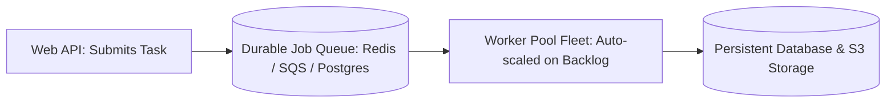

# Background Job Processing Architecture

## 1. Overview & Architectural Philosophy
Asynchronous background job processing decouples resource-intensive, long-running, or deferred tasks (video rendering, invoice PDF generation, payroll calculation, batch data sync) from client-facing synchronous web request lifecycles.

---

## 2. Universal Invariants of Job Systems
* **At-Least-Once Execution**: Workers may crash mid-execution. Jobs must be re-queued and retried safely without duplicating business side effects.
* **Idempotent Job Handlers**: Every job handler must tolerate multiple executions with identical inputs.
* **Bounded Concurrency & Timeouts**: Every background task must declare hard execution timeouts to prevent infinite loops from hanging worker threads.

---

## 3. Directory Structure
* [Background Jobs Architecture](background-jobs.md)
* [Scheduled Jobs Architecture](scheduled-jobs.md)
* [Cron Architecture](cron-architecture.md)
* [Job Queues](job-queues.md)
* [Worker Pools](worker-pools.md)
* [Job Retries](job-retries.md)
* [Job Idempotency](job-idempotency.md)
* [Job Prioritization](job-prioritization.md)
* [Delayed Jobs](delayed-jobs.md)
* [Batch Processing](batch-processing.md)
* [Dead Letter Jobs](dead-letter-jobs.md)
* [Job Monitoring](job-monitoring.md)
* [Distributed Cron](distributed-cron.md)
* [Celery vs. Sidekiq vs. BullMQ](celery-vs-sidekiq-vs-bullmq.md)
