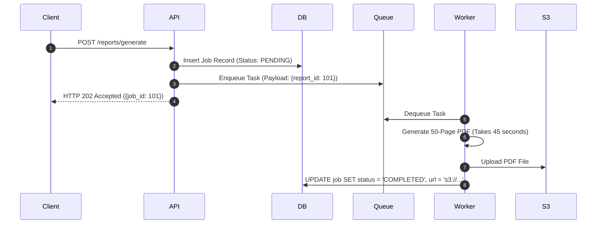

# Background Jobs Architecture

## 1. Decoupling Web Requests from Execution
Executing long-running tasks within an HTTP request thread risks gateway timeouts (`HTTP 504`) and client thread starvation. Background jobs shift processing to asynchronous worker fleets:

