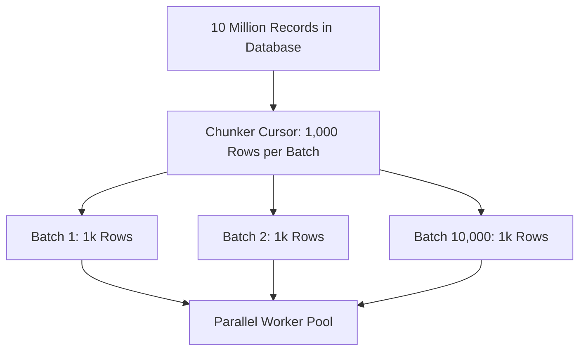

# Batch Processing Architecture

## 1. Chunking & Streaming Large Datasets
Processing 10 million database rows in a single in-memory collection triggers catastrophic JVM/Node.js Out-Of-Memory crashes.

---

## 2. Checkpointing & Resume Capability
Save processing progress in durable storage:
`checkpoint = { last_processed_id: 4892100, completed_at: ... }`.
If the batch worker crashes at record $4,892,100$, the replacement worker resumes from the checkpoint rather than restarting from record 0.
