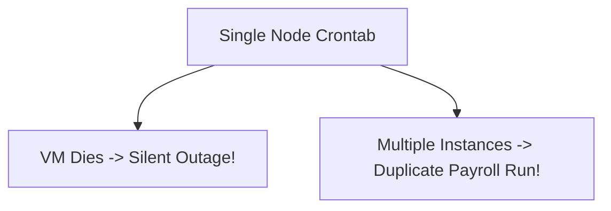

# Cron Architecture & Single-Point-of-Failure Hazards

## 1. The Single-Node Cron Anti-Pattern
Relying on traditional Linux `crontab` on a single virtual machine introduces catastrophic failure modes:
* If that single VM crashes or reboots, scheduled jobs fail silently.
* Scaling out web instances replicates the crontab, executing the same billing run 10 times concurrently.

