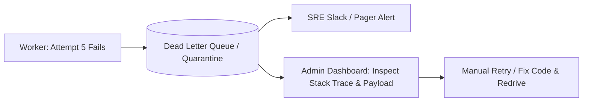

# Dead Letter Job Handling & Quarantine

## 1. Isolating Poison Tasks
When a background job exhausts its maximum configured retry attempts (e.g., 5 attempts), it is quarantined into a **Dead Letter Queue (DLQ)**.

