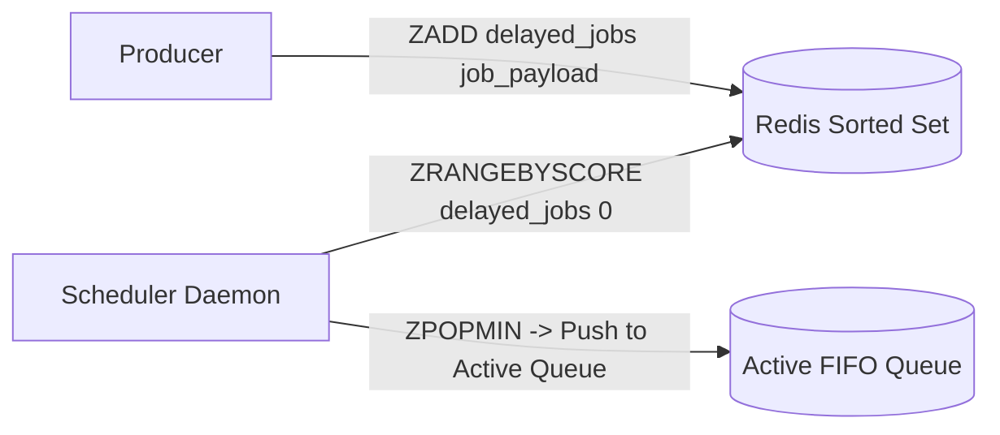

# Delayed Jobs & Scheduled Execution

## 1. Sorted Sets for Millisecond-Accurate Delays
In Redis-based job queues (BullMQ, Sidekiq), delayed jobs are stored in a **Redis Sorted Set (ZSET)**:
* **Member**: Job Payload / ID.
* **Score**: Unix timestamp in milliseconds when the job should execute ($\text{timestamp}_{\text{now}} + \Delta t$).

