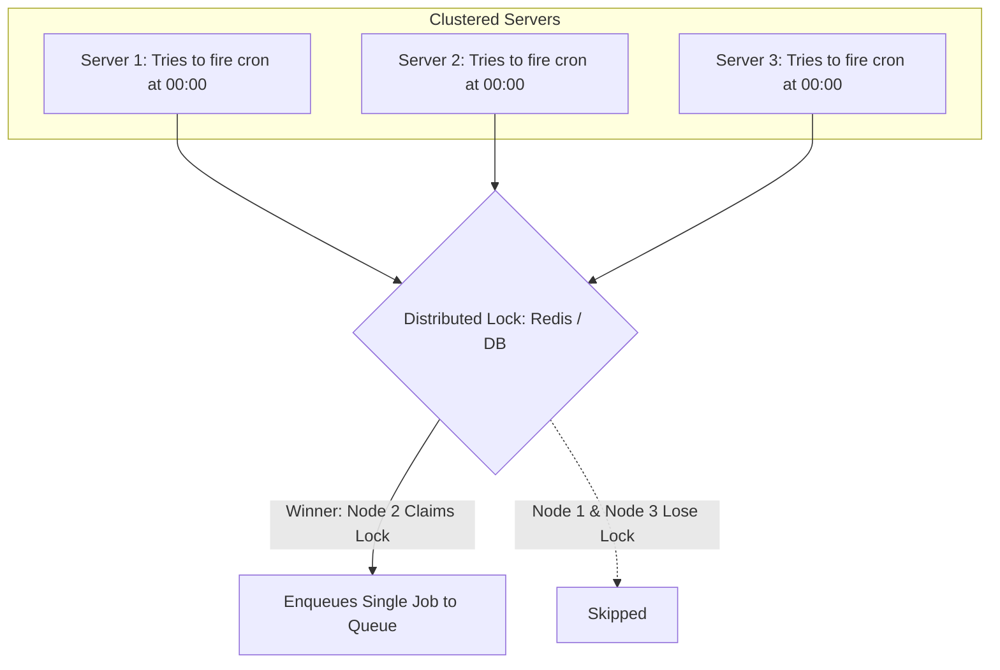

# Distributed Cron Architecture

## 1. High-Availability Scheduled Execution
Distributed cron ensures that a scheduled job executes **exactly once per scheduled interval**, even across a cluster of 50 servers.



---

## 2. Distributed Lock with Lease
```sql
-- PostgreSQL Atomic Leader Election for Cron
UPDATE cron_jobs 
SET last_executed_at = NOW(), locked_by = 'node_2'
WHERE job_name = 'nightly_billing' 
  AND (last_executed_at < NOW() - INTERVAL '23 hours' OR last_executed_at IS NULL);
```
* Only one node updates the row atomically, guaranteeing exactly-once scheduling.
