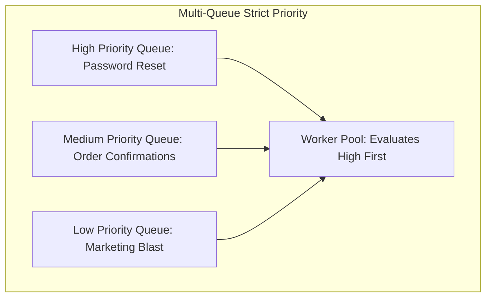

# Job Prioritization Architecture

## 1. Priority Inversion & Queue Starvation
If a single queue processes both high-priority transactional emails (password reset) and low-priority bulk marketing blasts (1,000,000 promotional emails), password resets are delayed by hours.

---

## 2. Fair-Share Weighted Worker Allocation
Rather than starving low-priority queues completely:
* Assign dedicated worker ratios: $60\%$ workers to High, $30\%$ to Medium, $10\%$ to Low.
