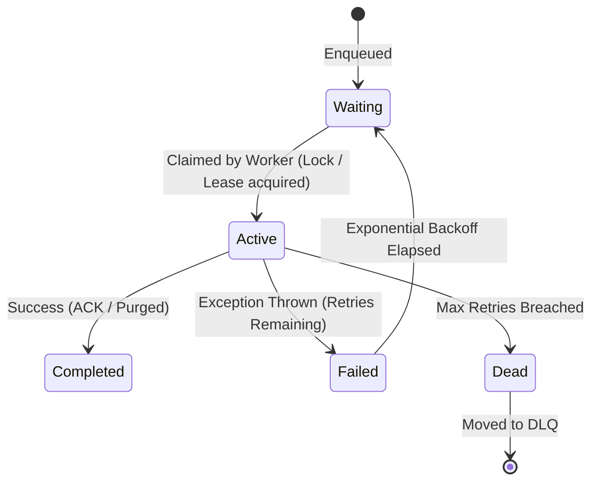

# Job Queues & State Engines

## 1. Job State Machine
A robust job queue enforces strict state transitions across the task lifecycle:

---

## 2. Storage Engines for Job Queues
* **Redis (BullMQ, Sidekiq)**: Blazing speed ($O(1)$ transitions, in-memory Sorted Sets for delays); single-digit millisecond latency.
* **Relational Database (PostgreSQL SKIP LOCKED)**: Strict ACID, zero extra infrastructure; uses `SELECT ... FOR UPDATE SKIP LOCKED` for concurrent worker claiming.
* **Cloud Managed Queues (AWS SQS, Google Cloud Tasks)**: Serverless, infinite scale, zero operational maintenance.
