# 01 — System Design Framework

## Purpose

The System Design Framework provides an authoritative, repeatable, end-to-end engineering methodology for taking an ambiguous, complex business problem and decomposing it into a scalable, reliable, secure, cost-effective, and operable distributed architecture.

It establishes an architectural discipline that prevents teams from leaping prematurely from "business requirements" to "microservices and Kubernetes," ensuring that every structural component is empirically justified by functional drivers and operational constraints.

---

## Problem It Solves

- **Premature Convergence**: Prevents selecting technologies based on industry hype (e.g., introducing Kafka or distributed NoSQL before understanding access patterns and concurrency).
- **Architectural Amnesia & Drift**: Prevents uncoordinated design decisions where components fail to integrate or duplicate capabilities.
- **Under-provisioning vs. Over-engineering**: Eliminates designs that either collapse under unexpected surges or cost $50,000/month for a 10 RPS workload.
- **Failure Blindness**: Ensures failure modes, network partitions, and data corruptions are modeled prior to writing production code.

---

## Inputs

- **Business Problem Statement**: Core executive vision or market opportunity.
- **Product Requirements Document (PRD)**: Initial feature lists and user journeys.
- **Stakeholder Constraints**: Delivery timelines, budgetary limits, team size, compliance regimes (PCI-DSS, HIPAA, GDPR).
- **Target Scale Projections**: Expected Day-1 users, 3-year growth rate, peak traffic multipliers.

---

## Decision Process: The 28-Step Architecture Pipeline

```mermaid
flowchart TD
    subgraph ProblemSpace["1. Problem & Requirements Space"]
        S1["01. Framework Baseline"] --> S2["02. Requirements Analysis"]
        S2 --> S3["03. Functional Requirements"]
        S3 --> S4["04. Non-Functional Requirements"]
        S4 --> S5["05. Constraints Analysis"]
        S5 --> S6["06. Traffic Modeling"]
    end

    subgraph Sizing["2. Sizing & Structural Decomposition"]
        S6 --> S7["07. Scale Estimation"]
        S7 --> S8["08. Capacity Planning"]
        S8 --> S9["09. Domain Decomposition (DDD)"]
        S9 --> S10["10. API Design"]
        S10 --> S11["11. Data Modeling"]
        S11 --> S12["12. Data Access Patterns"]
    end

    subgraph Infrastructure["3. Runtime & Persistence Architecture"]
        S12 --> S13["13. Caching Strategy"]
        S13 --> S14["14. Messaging Strategy"]
        S14 --> S15["15. Async Processing"]
        S15 --> S16["16. Storage Selection"]
        S16 --> S17["17. Load Balancing"]
        S17 --> S18["18. Scaling Strategy"]
        S18 --> S19["19. Consistency Strategy"]
    end

    subgraph Operations["4. Resilience, Governance & Production"]
        S19 --> S20["20. Failure Analysis"]
        S20 --> S21["21. Resilience Strategy"]
        S21 --> S22["22. Security Analysis"]
        S22 --> S23["23. Observability Analysis"]
        S23 --> S24["24. Disaster Recovery"]
        S24 --> S25["25. Cost & FinOps"]
        S25 --> S26["26. Trade-Off Analysis"]
        S26 --> S27["27. Architecture Review"]
        S27 --> S28["28. Production Readiness"]
    end
```



---

## Important Probing Questions

1. *What is the actual business value metric, and how does this architecture directly protect or generate that value?*
2. *What is the blast radius if this system crashes completely for 1 hour?*
3. *What are the non-negotiable architectural drivers (e.g., latency vs. consistency vs. availability)?*
4. *Can this system be built as a simple modular monolith today, or does team autonomy (Conway's Law) strictly mandate distributed services?*
5. *How will this architecture evolve when traffic multiplies by 10x?*

---

## Key Metrics

- **Requirements Coverage Ratio**: % of Architecturally Significant Requirements (ASRs) mapped to structural blocks.
- **Architectural Risk Density**: Number of unmitigated Single Points of Failure (SPOFs) in the design.
- **Cost Efficiency Index**: Projected Cost per Million Transactions vs. business gross margin.
- **Review Velocity**: Time elapsed from inception to formal Architecture Review Board (ARB) ratification.

---

## Common Mistakes

- **Starting with Topology**: Drawing boxes and arrows (API Gateway, Redis, Kafka, Cassandra) before calculating QPS, write volumes, and data models.
- **Treating Design as Waterfall**: Producing a static 200-page document that is immediately discarded during agile sprints.
- **Assuming Infinite Scale**: Designing for Google or Netflix scale (billions of users) for an internal enterprise system with 5,000 corporate users.
- **Neglecting Day-2 Operability**: Failing to architect for schema migrations, data archival, telemetry, and on-call runbooks.

---

## Architectural Implications

- **Paved-Road Adoption**: Enforces utilizing standardized enterprise platforms rather than reinventing authentication, logging, and deployment pipelines.
- **Architecture as Code**: Models, ADRs, and diagrams are versioned in Git repositories alongside application source code.
- **Automated Verification**: Architecture invariants are enforced via automated fitness functions (ArchUnit / NetArchTest) in CI/CD.

---

## Concrete Enterprise Example: Global Payment Gateway Inception

```mermaid
sequenceDiagram
    autonumber
    participant Sponsor as VP of Payments (Business)
    participant Architect as Solution Architect
    participant Team as Lead Engineers & SecOps

    Sponsor->>Architect: "We need a new global payment gateway handling $5B annually."
    Architect->>Sponsor: Probe Drivers: Target latency? Geographic scope? PCI DSS compliance boundaries?
    Sponsor-->>Architect: Must achieve p99 < 200ms; multi-region (US/EU); strict zero-overdraft ledger.
    Architect->>Team: Execute 28-Step System Design Framework:
    Note over Architect,Team: 1. Scale Sizing -> 2. Domain Modeling -> 3. Outbox Pattern -> 4. Multi-AZ Aurora
    Team-->>Architect: Formalize ADRs, C4 Models, and FinOps TCO Projections
    Architect->>Sponsor: Present Architecture Review Dossier for ARB Sign-off
```

---

## Trade-offs

| Optimization Goal | Accepted Compromise | Architectural Rationale |
|:---|:---|:---|
| **Rigor & Completeness** | **Upfront Analysis Overhead** | Spending 1–2 weeks on structural analysis saves 6+ months of refactoring failed architectures. |
| **Paved-Road Standardization**| **Individual Team Technology Freedom**| Constraining language/database choices accelerates long-term enterprise maintainability. |

---

## Production Considerations

- **Iterative Refinement**: Re-run the framework whenever a major business inflection point occurs (e.g., 5x user growth or new regulatory scope).
- **Living Deliverables**: Ensure Architecture Decision Records (ADRs) are updated as runtime constraints emerge during delivery.
