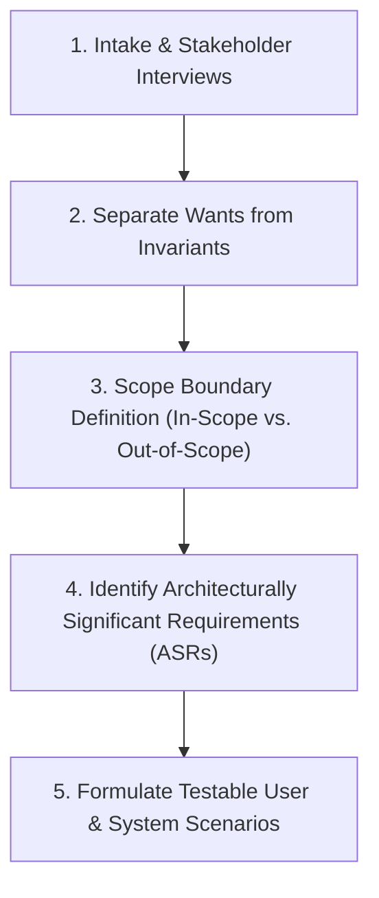

# 02 — Requirements Analysis

## Purpose

Requirements Analysis is the systematic process of discovering, clarifying, prioritizing, and bounding the technical and business expectations of a system. It transforms ambiguous stakeholder requests into crisp, unambiguous architectural drivers that dictate system boundaries, data contracts, and operational quality attributes.

---

## Problem It Solves

- **Scope Creep & Shifting Goals**: Prevents engineering teams from building features that solve the wrong problem or delivering unrequested functionality.
- **Hidden Invariants**: Uncovers subtle, unstated business rules (e.g., "users can only cancel an order within 5 minutes of placement") before database schemas and APIs are locked down.
- **Unverified Assumptions**: Eliminates the danger of engineering teams guessing scale or availability targets in isolation.

---

## Inputs

- **Business Vision Charter & User Personas**: Target customers, revenue models, and operational actors.
- **Product Backlogs & User Stories**: High-level Jira epics, wireframes, and customer workflows.
- **Regulatory & Compliance Documentation**: Regional legal mandates (GDPR, HIPAA, PCI DSS, SOC 2).
- **Existing Legacy Interfaces**: Specifications of upstream/downstream enterprise platforms requiring integration.

---

## Decision Process

1. **Conduct Adversarial Probing**: Interview business sponsors using the "5 Whys" to discover the true underlying problem rather than the requested solution.
2. **Classify by Architectural Gravity**: Isolate the 10% of requirements that dictate structural topology (ASRs) from the 90% that are simple CRUD logic.
3. **Bound the System Context**: Explicitly establish what the system **will NOT do** in Phase 1 to prevent project bloat.
4. **Define Invariants**: Formalize business invariants that must mathematically never be violated (e.g., "ledger balances cannot be negative").

---

## Important Probing Questions

- *What happens if the system is unavailable during peak hours? Is downtime merely an annoyance or does it cost $100,000/minute?*
- *Are there geographical restrictions on where customer data can be physically stored or processed?*
- *What is the exact data retention policy? Can records older than 1 year be archived or deleted?*
- *Who are the secondary actors (e.g., fraud investigators, compliance auditors, customer support)?*

---

## Key Metrics

- **ASR Density**: Count of identified architecturally significant requirements.
- **Requirement Ambiguity Score**: % of requirements lacking measurable acceptance criteria (target: 0%).
- **Scope Boundary Ratio**: Ratio of explicitly excluded features vs. included features.

---

## Common Mistakes

- **Accepting Technology Solutions as Requirements**: When a business stakeholder says *"We need a Kafka event stream,"* treating that as a requirement instead of probing: *"Why? What is the throughput, fanout, and temporal latency requirement?"*
- **Ignoring Edge Cases**: Designing solely for the happy path and failing to specify behavior when third parties timeout or reject requests.
- **Conflating Scale with Complexity**: Assuming high scale requires complex architecture when straightforward caching and database indexing suffice.

---

## Architectural Implications

- Establishes the **System Boundary** and initial C4 Level 1 Context Diagram.
- Dictates whether the architecture requires asynchronous message brokers, distributed transactions, or polyglot storage engines.
- Determines whether compliance mandates require physically isolated VPC enclaves.

---

## Example: E-Commerce Return & Refund Inception

| Raw Stakeholder Request | Architectural Analysis & Probing | Formal Architectural Requirement (ASR) |
|:---|:---|:---|
| *"Allow customers to return items easily on the mobile app."* | How long after delivery? Can items be returned without physical inspection? What happens to the payment card refund? | **ASR-RET-01**: Items may be returned within 30 days of delivery. Refund authorization must be held in `PENDING_INSPECTION` state until warehouse barcode scan emits `ItemReceived` event via Kafka. |

---

## Trade-offs

| Strategy | Benefit | Trade-off / Cost |
|:---|:---|:---|
| **Deep Exhaustive Analysis** | Eliminates downstream rework and architectural redesign. | Increases inception lead time; delays immediate coding sprints. |
| **Just-in-Time Agile Analysis** | Enables rapid rapid prototyping and immediate MVP delivery. | Risks discovering fatal structural blockers after database schemas are locked. |

---

## Production Considerations

- Document requirements as **Architecture Quality Scenarios** with measurable stimulus and response metrics.
- Treat requirements as version-controlled artifacts stored in Git alongside design blueprints.
