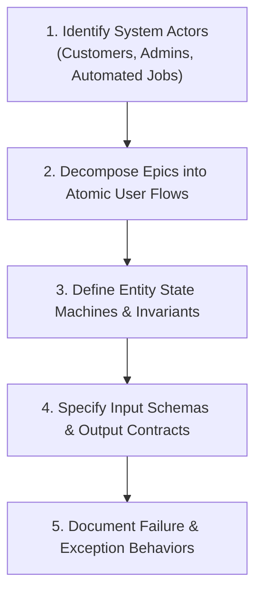

# 03 — Functional Requirements Specification

## Purpose

Functional Requirements define the specific behavioral capabilities, operations, transformations, workflows, and calculations that a software system must execute to satisfy business goals and user needs.

In system design, functional requirements establish the **contracts of interaction** between human actors, client applications, and backend subsystems.

---

## Problem It Solves

- **Vague Acceptance Criteria**: Eliminates ambiguous statements like "the system allows searching" by defining query parameters, filter capabilities, pagination rules, and result sorting.
- **Missing State Transitions**: Prevents race conditions and unhandled entity states by formally modeling lifecycles (e.g., `Draft` $\rightarrow$ `Pending` $\rightarrow$ `Authorized` $\rightarrow$ `Settled` $\rightarrow$ `Refunded`).
- **Unbounded API Boundaries**: Ensures every backend endpoint maps directly to a validated business use case.

---

## Inputs

- **User Story Maps**: Visual journey maps showing user tasks and epic progressions.
- **Domain Workflows**: Step-by-step business processes (e.g., loan approval credit underwriting rules).
- **External Integration Contracts**: Third-party API specifications, webhooks, and legacy file formats.

---

## Decision Process



---

## Important Probing Questions

- *What is the exact sequence of events when this user flow succeeds?*
- *What happens when an operation fails halfway through (e.g., inventory deduction succeeds, but payment card charge declines)?*
- *Can this operation be triggered concurrently by multiple actors (e.g., two users editing the same document or buying the last concert ticket)?*
- *What audit records must be emitted upon completion of this action?*

---

## Key Metrics

- **Functional Completeness**: % of identified user personas with fully specified happy-path and sad-path workflows.
- **Contract Test Coverage**: % of functional endpoints backed by automated consumer-driven contract tests (Pact).
- **State Machine Determinism**: Total number of explicit states vs. unhandled edge-case states in entity lifecycles.

---

## Common Mistakes

- **Conflating Functional with Non-Functional**: Writing *"The API must respond in 50ms"* under functional requirements. (Latency is an NFR; returning the user's current balance is the functional requirement).
- **Missing Compensation Workflows**: Defining how to charge a credit card, but failing to specify the functional flow for charge reversals or partial refunds.
- **Ignoring Concurrency Contention**: Assuming users act sequentially and failing to define double-booking behavior.

---

## Architectural Implications

- Functional workflows dictate the boundaries of **Aggregates and Entities** in Domain-Driven Design (DDD).
- Multi-step workflows spanning disparate domains mandate adopting the **Saga Pattern** or distributed workflow orchestrators (Temporal / Step Functions).
- State-heavy workflows require durable state machine persistence rather than volatile in-memory sessions.

---

## Concrete Example: Vehicle Dispatch System (Ride-Hailing)

```markdown
### FR-DISPATCH-01: Driver Matching & Dispatch
- **Actor**: Mobile Passenger Application
- **Trigger**: Passenger confirms pickup location and vehicle category.
- **Preconditions**:
  1. Passenger payment card token is authorized for estimated fare hold.
  2. Passenger has zero unpaid historical cancellation fees.
- **Happy Path Workflow**:
  1. System queries geospatial index for the 10 closest available drivers within 5 km.
  2. System dispatches a 15-second offer to the closest driver.
  3. If driver accepts within 15s, ride status updates to `MATCHED`; driver details returned to passenger.
- **Alternative / Sad Path Workflow**:
  - If driver rejects or timeout elapses, offer cascades sequentially to the next closest driver.
  - If 3 drivers decline or 60s total time elapses, system returns `NO_DRIVERS_AVAILABLE` with graceful retry advice.
- **Postconditions**:
  - Driver location telemetry stream bound to passenger WebSocket session.
```

---

## Trade-offs

| Approach | Benefit | Trade-off / Cost |
|:---|:---|:---|
| **Exhaustive Formal Specifications** | Zero developer confusion; predictable testing and delivery. | Slower documentation cadence; risk of specification fatigue. |
| **Lightweight User Stories** | Fast agile velocity; encourages developer autonomy. | High risk of missed edge cases, missing failure states, and rework. |

---

## Production Considerations

- Convert functional requirements directly into **Behavior-Driven Development (BDD) specifications (Gherkin syntax)** to ensure acceptance criteria are executable by automated test harnesses.
