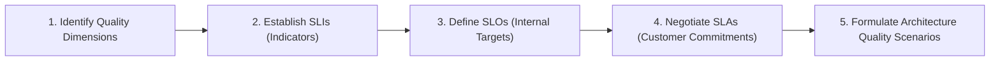
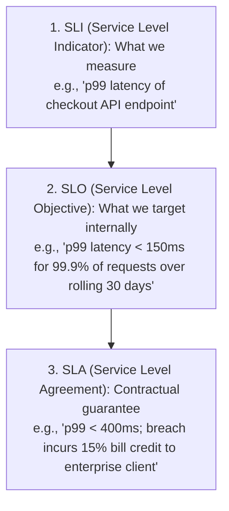

# 04 — Non-Functional Requirements (NFR) Formulation

## Purpose

Non-Functional Requirements (NFRs)—also known as **Quality Attributes** or **Architectural Characteristics**—define *how well* a software system executes its functional behaviors. They govern operational properties such as latency, throughput, availability, durability, security, and maintainability.

In enterprise solution architecture, NFRs exert vastly more structural gravity on system topology than functional stories.

---

## Problem It Solves

- **Unquantifiable Desires**: Eliminates vague, untestable business wishes (e.g., *"The system must be fast, secure, and always up"*) by translating them into verifiable mathematical Service Level Objectives (SLOs).
- **Architectural Misalignment**: Prevents building a lightweight single-server app when the business requires 99.999% availability, or building a multi-region active-active cluster when the business only needs 99.5% uptime.
- **Unbudgeted Cloud Sprawl**: Prevents over-engineering architectures that inflate cloud hosting spend by 10x.

---

## Inputs

- **Business Criticality Tiering**: System tier (Tier 0 Mission-Critical vs. Tier 3 Internal Utility).
- **Financial Cost of Downtime**: Dollar loss per minute of outage.
- **User Experience Expectations**: Target conversion rates and acceptable mobile latency thresholds.
- **Regulatory Frameworks**: PCI DSS, HIPAA, GDPR, SOC 2, ISO 27001.

---

## Decision Process

---

## Important Probing Questions

- *What is the maximum acceptable p95 and p99 latency under normal and surge traffic?*
- *What is the Recovery Point Objective (RPO) and Recovery Time Objective (RTO) during a catastrophic data center blackout?*
- *Does the system require immediate linearizable consistency, or can read data be eventually consistent by up to 2 seconds?*
- *What is the projected 3-year data volume, and what are the compliance data retention horizons?*

---

## Key Metrics & The SRE Hierarchy

---

## Common Mistakes

- **Treating All Endpoints Identically**: Requiring 99.999% availability on internal admin reporting tools that are only used during business hours.
- **Using Averages for Latency**: Measuring "average response time" instead of p95, p99, and p99.9 percentiles. Averages hide the fact that 1 out of 100 users experiences a 5-second freeze.
- **Ignoring Degradation Modes**: Failing to specify how the system behaves when under stress (e.g., dropping recommendations to preserve checkout).

---

## Architectural Implications

- High Availability ($\ge 99.99\%$) forces **Multi-AZ and Multi-Region automated failover topologies**.
- Sub-100ms p99 Latency at high read volume mandates **Multi-Tier Distributed Caching (CDN + Redis)**.
- Strict Consistency mandates **Two-Phase Locking, Relational ACID, or Consensus Protocols (Raft)**, directly reducing availability during network splits (CAP theorem).

---

## Concrete Example: High-Throughput Trading API NFR Matrix

| Quality Attribute | Service Level Indicator (SLI) | Service Level Objective (SLO) | Architectural Implementation Mechanism |
|:---|:---|:---|:---|
| **Latency** | Order placement HTTP POST response time | $p99 \le 35\text{ms}$ at 10,000 RPS | In-memory processing (Go / Netty), non-blocking async I/O, binary Protobuf over gRPC. |
| **Availability** | Successful HTTP 2xx/4xx requests vs. 5xx errors | $\ge 99.99\%$ uptime over rolling 30 days | Multi-AZ active-active deployment behind AWS ALB with health probes. |
| **Durability** | Data loss during node crash | $\text{RPO} = 0\text{ seconds}$ (Zero data loss) | Synchronous multi-AZ WAL replication on Aurora PostgreSQL; durable Kafka commit logs. |
| **Scalability** | Peak-to-baseline surge ratio | Handle $5\times$ baseline load within 60s | Kubernetes Horizontal Pod Autoscaling (HPA) using custom Kafka lag metrics. |

---

## Trade-offs

| Optimization | Sacrificed Dimension | Why the Tension Exists |
|:---|:---|:---|
| **Extreme Availability (99.999%)** | **Cost & Consistency** | Requires multi-region active-active clusters ($4x$ hosting cost) and accepting eventual consistency. |
| **Strict Linearizable Consistency** | **Latency & Throughput** | Distributed locking and synchronous consensus (Raft/2PC) add network round-trips to every write. |

---

## Production Considerations

- Embed NFR targets directly into **Continuous Integration (CI/CD) automated fitness functions** (e.g., Gatling/k6 load test gates that fail builds if p99 latency exceeds 200ms).
- Configure real-time **Error Budget Burn Rate Alerts** in Prometheus/Datadog to halt deployments before SLAs are breached.
