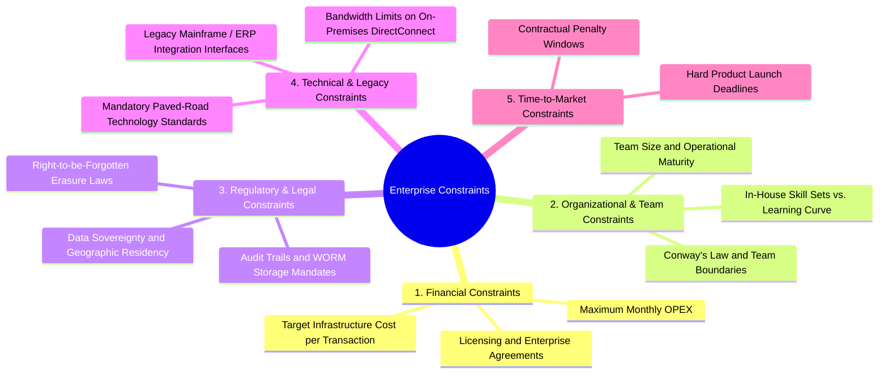

# 05 — Architectural Constraints Analysis

## Purpose

Constraints Analysis identifies, evaluates, and documents the non-negotiable boundaries, limitations, and external realities that restrict architectural freedom. Unlike requirements (which state what the system *should do*), constraints dictate what the architecture *must live within*.

Senior Solution Architects recognize that **constraints are the primary shapers of viable architectures**. Ignoring organizational, financial, legal, or physical constraints leads to designs that are technically brilliant on paper but impossible to execute or operate in reality.

---

## Problem It Solves

- **Ivory-Tower Architecture**: Prevents designing architectures that require skills the existing engineering team does not possess (e.g., choosing Rust and Cassandra for a team of junior Python developers).
- **Budgetary Shocks**: Prevents designing cloud topologies that breach corporate capital (CAPEX) or operational (OPEX) spending ceilings.
- **Regulatory Penalties**: Ensures data sovereignty, privacy laws, and industry compliance rules are factored in before data persistence models are selected.

---

## Inputs

- **Financial Budgets**: Target monthly cloud infrastructure spend and third-party SaaS software licensing limits.
- **Organizational Structure & Skills**: Team headcount, skill distribution, geographic locations, and Conway's Law dynamics.
- **Regulatory & Legal Frameworks**: GDPR (EU data residency), HIPAA (US healthcare), PCI DSS 4.0 (payment cards), FedRAMP.
- **Legacy Technical Environment**: Existing on-premises data centers, mainframe cores, ERP systems, and mandatory enterprise technology standards.

---

## Decision Process: The 5 Constraint Vectors

---

## Important Probing Questions

- *What is the hard ceiling for monthly cloud infrastructure spend?*
- *Can data leave the borders of the European Union or United States?*
- *Does the enterprise have existing volume-discount contracts with specific cloud providers (e.g., AWS vs. Azure)?*
- *Who will be on-call to support this system at 3:00 AM? Do they have Kubernetes and distributed systems expertise?*

---

## Key Metrics

- **Constraint Saturation Index**: Degree to which candidate architectures approach budget or bandwidth limits (target: $< 75\%$).
- **Compliance Defect Density**: Number of identified violations of corporate technology standards or regulatory mandates.
- **Time-to-Delivery Confidence**: Probability of meeting target launch dates within team skill constraints.

---

## Common Mistakes

- **Fighting Conway's Law**: Imposing a 20-microservice architecture on a single co-located team of 5 engineers, or a monolithic repository on 8 globally distributed teams across 4 time zones.
- **Ignoring Data Sovereignty**: Storing global customer data in a centralized US-East AWS bucket, immediately violating GDPR Article 44 cross-border transfer laws.
- **Underestimating Legacy Integration Latency**: Assuming on-premises legacy mainframes can handle modern 10,000 RPS API call volumes.

---

## Architectural Implications

- Strict regulatory requirements (e.g., PCI DSS 4.0) force **quarantining sensitive payment tokenization into isolated VPC enclaves** to minimize audit scope.
- Hard launch deadlines (e.g., 3-month MVP) mandate **adopting proven Modular Monoliths and managed PaaS** over complex distributed microservices.
- Fixed budget ceilings dictate using **Auto-Scaling, Spot Instances, and FinOps lifecycle policies**.

---

## Concrete Example: Healthcare Telemetry Platform Constraints

| Constraint Vector | Identified Enterprise Constraint | Concrete Architectural Consequence |
|:---|:---|:---|
| **Regulatory** | HIPAA mandates all Patient Health Information (PHI) encrypted with Customer-Managed Keys (CMK) and audited. | Banned shared storage; mandated AWS KMS envelope encryption with CloudTrail tamper-proof logging. |
| **Financial** | Maximum infrastructure budget of $4,000/month for Year 1. | Disallowed multi-region active-active clusters; selected single-region multi-AZ Aurora Serverless with S3 lifecycle archival. |
| **Team Skills** | Team consists of 8 experienced C#/.NET engineers with zero Go or Kubernetes experience. | Standardized on .NET 8 on AWS ECS Fargate; completely avoided Kubernetes cluster management overhead. |

---

## Trade-offs

| Constraint Strategy | Advantage | Trade-Off / Cost |
|:---|:---|:---|
| **Strict Paved-Road Conformance** | Low operational risk; shared infrastructure; fast onboarding. | May prevent using specialized bleeding-edge tools optimized for niche throughput. |
| **SaaS Outsource Strategy (Buy vs. Build)**| Instant time-to-market; shifts operational burden. | High recurring OPEX cost; vendor lock-in; customization limits. |

---

## Production Considerations

- Document all accepted constraints explicitly in the **Solution Architecture Document (SAD)** and link them directly to Architecture Decision Records (ADRs).
- Review constraints semi-annually; organizational growth and funding changes often loosen historical constraints.
