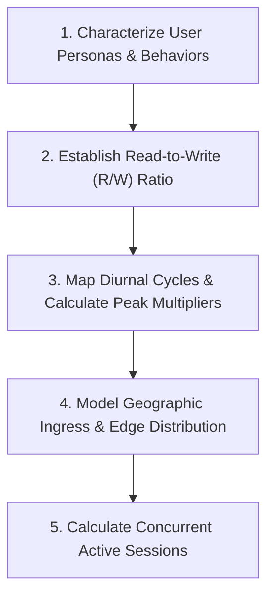
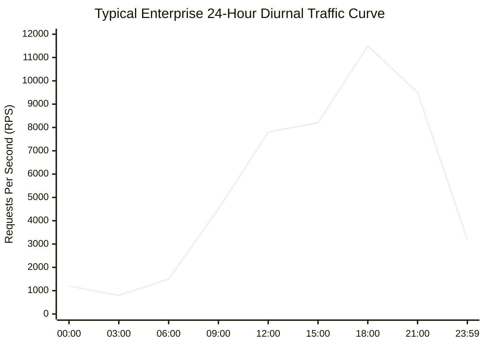

# 06 — User and Traffic Modeling

## Purpose

User and Traffic Modeling is the quantitative discipline of characterizing who uses a system, how they interact with it, and the statistical distribution of incoming traffic over time. It models user behaviors into concrete mathematical arrival rates, concurrency distributions, geographic origin maps, and session lifecycles.

Traffic modeling provides the empirical inputs required for **Scale Estimation, Capacity Planning, and Network Edge Architecture**.

---

## Problem It Solves

- **The "Average Traffic" Fallacy**: Prevents provisioning systems for average traffic (e.g., 500 RPS) that collapse when real-world diurnal peaks or promotional spikes hit 5,000 RPS.
- **Underestimating Read/Write Asymmetry**: Prevents treating reads and writes as equal when typical web architectures experience 50:1 or 100:1 read-to-write ratios.
- **Geographic Latency Blindness**: Prevents deploying systems in a single data center when 60% of users originate on another continent, incurring 200ms cross-ocean round-trip penalties.

---

## Inputs

- **Total Registered Users & Daily Active Users (DAU / MAU)**: Current baselines and marketing growth forecasts.
- **User Activity Profiles (Personas)**: Actions performed per active session (e.g., searches per user, views per post, checkouts per cart).
- **Historical Traffic Logs & Analytics**: Google Analytics / Cloudflare access logs showing hourly diurnal cycles and seasonal peaks (Cyber Monday, tax deadlines).
- **Geographic User Distribution**: Traffic breakdown by region (Americas, EMEA, APAC).

---

## Decision Process

---

## Mathematical Modeling Formulas

### 1. Daily Active Users (DAU) from Total Base
$$\text{DAU} = \text{Total Registered Users} \times \text{Daily Active Ratio } (\text{typically } 10\% - 30\%)$$

### 2. Baseline Average Throughput (RPS)
$$\text{Average RPS} = \frac{\text{DAU} \times \text{Requests per User per Day}}{86,400\text{ seconds}}$$

### 3. Peak Traffic Multiplier ($M_{\text{peak}}$)
Traffic is rarely uniform over 24 hours. Diurnal curves show traffic concentrating in peak evening hours:
$$\text{Peak Factor } M_{\text{peak}} = \frac{\text{Peak Hourly Traffic}}{\text{Average Hourly Traffic}} \quad (\text{typically } 2.5\times \text{ to } 5\times; \text{ up to } 10\times \text{ for flash sales})$$
$$\text{Peak RPS} = \text{Average RPS} \times M_{\text{peak}}$$

### 4. Concurrent Active Connections
Using Little's Law ($L = \lambda W$):
$$\text{Concurrent Connections} = \text{Peak RPS} \times \text{Average Request Latency (seconds)}$$

---

## Diurnal Traffic Pattern Visualization

---

## Important Probing Questions

- *What is the ratio of read operations to write operations?*
- *Are traffic spikes predictable (e.g., daily 9:00 AM market open) or unpredictable (e.g., breaking news alerts)?*
- *How long does a user session remain active? Are connections persistent (WebSockets) or short-lived (REST)?*
- *What percentage of requests originate from automated bots and scrapers vs. legitimate human users?*

---

## Key Metrics

- **Peak-to-Average Ratio**: Ratio of maximum instantaneous traffic to baseline average (e.g., 4.2x).
- **Read/Write Asymmetry**: e.g., 95% reads / 5% writes.
- **Geographic Latency Budget**: Round-trip time (RTT) from client devices to nearest edge points of presence (PoP).

---

## Common Mistakes

- **Assuming 24-Hour Uniform Distribution**: Dividing daily requests by 86,400 and sizing servers for that number without applying a peak multiplier, guaranteeing downtime during peak hours.
- **Ignoring Bot & Webhook Surges**: Failing to account for automated third-party webhooks that replay 100,000 events simultaneously.
- **Forgetting Network Keep-Alive**: Neglecting to model concurrent open TCP connections, leading to socket table exhaustion on reverse proxies.

---

## Architectural Implications

- High Read/Write Asymmetry ($> 20:1$) mandates **Read-Replicas, CQRS, and Multi-Tier Caching (CDN + Redis)**.
- Extreme Peak-to-Average Ratios ($> 5\times$) mandate **Queue-Based Load Leveling (Kafka / SQS)** to flatten write spikes.
- Global Geographic Dispersion mandates **Anycast DNS routing and Edge Compute (Cloudflare Workers / Lambda@Edge)**.

---

## Worked Example: Streaming Video Platform

- **Total Registered Users**: 50,000,000
- **Daily Active Ratio**: 20% $\rightarrow \text{DAU} = 10,000,000$ users/day.
- **User Activity**:
  - Each user browses 30 titles (Reads) $\rightarrow 300,000,000$ read requests/day.
  - Each user watches 2 videos, rating 0.1 titles (Writes) $\rightarrow 1,000,000$ write requests/day.
- **Read-to-Write Ratio**: $300:1$ (Extreme read dominance).
- **Average Read RPS**: $\frac{300,000,000}{86,400} \approx 3,472\text{ RPS}$.
- **Peak Multiplier**: $3.5\times$ (Evening streaming surge).
- **Peak Read RPS**: $3,472 \times 3.5 \approx \mathbf{12,150\text{ RPS}}$.
- **Peak Write TPS**: $\frac{1,000,000}{86,400} \times 3.5 \approx \mathbf{40\text{ TPS}}$.

---

## Trade-offs

| Strategy | Benefit | Trade-off / Cost |
|:---|:---|:---|
| **Provision for Absolute Peak** | Zero risk of scaling lag or cold-start dropouts. | Significant idle cloud waste ($$$$) during off-peak hours. |
| **Aggressive Dynamic Auto-Scaling**| Highly cost-effective; pays only for current load. | Vulnerable to sudden flash surges before auto-scalers provision new instances. |

---

## Production Considerations

- Implement **Rate Limiting at the API Gateway** to protect backend services from abusive traffic spikes.
- Model traffic profiles in **automated load test scripts (k6 / Locust)** to stress-test real diurnal ramp curves.
