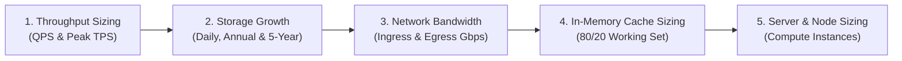

# 07 — Scale Estimation Methodology

## Purpose

Scale Estimation is the mathematical process of calculating the quantitative computational, storage, memory, and networking demands of a software system before committing engineering resources or purchasing cloud infrastructure.

It transforms abstract architectural blocks into physically viable engineering specifications.

---

## Problem It Solves

- **Hardware & Cloud Sizing Blindness**: Prevents guessing server counts, database tier sizes, and bandwidth allocations.
- **Architectural Misalignment**: Identifies early whether data will fit on a single database instance or requires horizontal sharding.
- **Storage Cost Surprises**: Forecasts 5-year storage growth and cloud backup expenditures before data volume explosions occur.

---

## Inputs

- **User & Traffic Model**: Daily Active Users (DAU), average RPS, and peak multipliers from Step 06.
- **Payload Specifications**: Estimated size of average incoming requests and database records (in KB/MB).
- **Retention Policies**: Required operational storage horizons (e.g., 90 days hot, 5 years cold archive).
- **Working Set Target**: % of hot data targeted for caching (typically 20% according to the Pareto Principle).

---

## Decision Process: The 5 Quantitative Pillars

---

## Core Formulas & Calculation Standards

### 1. Daily & Annual Storage Volume
$$\text{Daily Storage} = \text{Daily Writes} \times \text{Average Payload Size}$$
$$\text{Annual Storage} = \text{Daily Storage} \times 365$$
$$\text{Raw 5-Year Storage} = \text{Annual Storage} \times 5$$
$$\text{Total Storage with Replication} = \text{Raw Storage} \times \text{Replication Factor (3x)} \times \text{Index Overhead Factor (1.4x)}$$

### 2. Network Bandwidth
$$\text{Ingress Bandwidth (Gbps)} = \frac{\text{Peak Write TPS} \times \text{Payload Size (Bytes)} \times 8}{1,000,000,000}$$
$$\text{Egress Bandwidth (Gbps)} = \frac{\text{Peak Read QPS} \times \text{Response Size (Bytes)} \times 8}{1,000,000,000}$$

### 3. In-Memory Cache Capacity (Pareto 80/20 Rule)
Assuming 20% of the active daily working set generates 80% of read traffic:
$$\text{Cache RAM Required} = \text{Daily Read Volume (Records)} \times 0.20 \times \text{Cached Entity Size}$$

---

## Important Probing Questions

- *What is the average and 99th-percentile size of incoming data payloads?*
- *How much storage overhead will database B-Tree indexes and WAL transaction logs consume? (Typically 40–50% extra).*
- *Can multimedia binaries (images, video, PDFs) be separated from relational metadata and offloaded to object storage (S3)?*
- *What is the network egress cost impact if responses are not compressed (gzip/brotli)?*

---

## Key Metrics

- **Peak Ingress / Egress Throughput**: Measured in Mbps or Gbps.
- **Storage Growth Rate**: Gigabytes or Terabytes accumulated per month.
- **Cache Hit Ratio (Projected)**: Target $\ge 85–95\%$.

---

## Common Mistakes

- **Confusing Bits and Bytes**: Forgetting that network bandwidth is measured in **bits per second (Gbps)** while storage is measured in **bytes (GB/TB)** ($1\text{ Byte} = 8\text{ bits}$).
- **Forgetting Replication Multipliers**: Sizing a database for 10 TB of raw data without multiplying by 3 for primary + 2 replicas, leading to an immediate out-of-disk incident.
- **Ignoring Database Index Bloat**: Assuming records take only the raw column sizes without accounting for B-Tree indexes, page headers, and MVCC bloat.

---

## Architectural Implications

- If 5-year storage exceeds **10 TB**, relational databases must be horizontally partitioned or sharded.
- If network egress exceeds **1 Gbps**, an external **Content Delivery Network (CDN)** is non-negotiable to offload origin compute.
- If peak write volume exceeds **5,000 TPS**, synchronous relational writes must be fronted by **asynchronous message queues (Kafka)**.

---

## Worked Example: Real-Time Telemetry System

- **Active IoT Devices**: 1,000,000 devices.
- **Telemetry Frequency**: Each device sends 1 heartbeat packet every 10 seconds $\rightarrow 100,000\text{ packets/second (TPS)}$.
- **Packet Size**: 500 Bytes.
- **Daily Ingestion Storage**:
  $$100,000\text{ writes/sec} \times 86,400\text{ sec} \times 500\text{ Bytes} \approx \mathbf{4.32\text{ TB / day}}$$
- **1-Year Raw Storage**:
  $$4.32\text{ TB} \times 365 \approx \mathbf{1,576.8\text{ TB} \approx 1.57\text{ Petabytes/year}}$$
- **Network Ingress Bandwidth**:
  $$\frac{100,000 \times 500 \times 8}{1,000,000,000} = \mathbf{0.4\text{ Gbps (400 Mbps sustained)}}$$
- **Architectural Conclusion**: Writing 1.57 PB/year at 100k TPS rules out standard single-instance relational databases. Sizing requires a distributed wide-column store (ScyllaDB / Cassandra) or time-series engine with S3 Parquet archiving.

---

## Trade-offs

| Estimation Philosophy | Benefit | Trade-off / Cost |
|:---|:---|:---|
| **Conservative (Over-Estimation)** | Ample headroom; protects against unexpected viral spikes. | Risk of premature procurement and higher initial cloud footprint. |
| **Aggressive (Lean Estimation)** | Minimizes Day-1 infrastructure spend; lowers initial budget. | Vulnerable to resource saturation and emergency scrambling under load. |

---

## Production Considerations

- Document assumptions explicitly: *“Estimates are assumptions, not exact measurements.”*
- Review real production metrics at 30 days post-launch to calibrate theoretical estimation models against reality.
