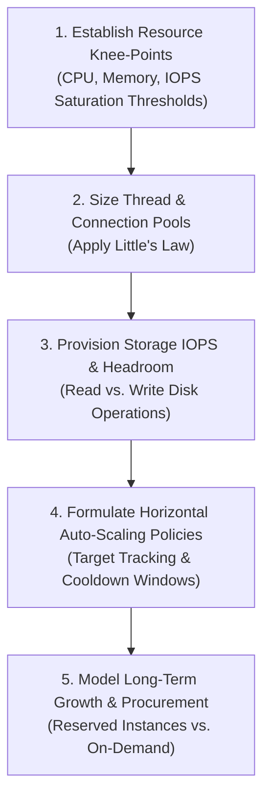

# 08 — Capacity Planning & Saturation Modeling

## Purpose

Capacity Planning is the operational and engineering practice of forecasting, provisioning, and allocating computational, storage, network, and memory resources over an ongoing operational timeline (1 to 3 years) to prevent system saturation and resource exhaustion.

While Scale Estimation calculates initial order-of-magnitude numbers, Capacity Planning incorporates **operational saturation limits, Little's Law thread sizing, storage IOPS limits, and seasonal buffer headroom**.

---

## Problem It Solves

- **The Saturation Cliff**: Prevents systems from operating safely at 60% CPU and then suddenly collapsing at 75% due to non-linear queuing contention (Universal Scalability Law).
- **Database Connection Starvation**: Prevents application containers from exhausting backend database connection limits, which leads to cascading thread lockups.
- **IOPS Throttling**: Prevents cloud storage disks (EBS) from silently exhausting burst credits and throttling disk throughput to zero during traffic surges.

---

## Inputs

- **Scale Estimation Outputs**: Peak RPS, storage growth rates, cache memory sizing from Step 07.
- **Hardware & Cloud Instance Profiles**: CPU cores, RAM limits, network bandwidth caps, and disk IOPS ratings of target VMs/containers.
- **Historical Seasonality**: Peak-to-trough ratios during seasonal events (Black Friday, Cyber Week, tax season).
- **Target Safety Headroom**: Organizational buffer policy (typically 30% to 50% unallocated headroom).

---

## Decision Process

---

## Mathematical Modeling & Little's Law

### 1. Connection & Thread Pool Sizing (Little's Law)
$$L = \lambda \times W$$
Where:
- $L$ = Number of concurrent active requests in the system.
- $\lambda$ = Arrival rate (Requests Per Second).
- $W$ = Average processing latency per request (in seconds).

*Example*: If peak arrival rate is $5,000\text{ RPS}$ and average database query latency is $10\text{ms } (0.010\text{s})$:
$$L = 5,000 \times 0.010 = \mathbf{50\text{ concurrent database connections needed across all pods}}$$

### 2. Capacity Safety Headroom Formula
$$\text{Provisioned Capacity} = \frac{\text{Projected Peak Load}}{1 - \text{Headroom Target}}$$
*Example*: If peak load is 8,000 RPS and corporate policy mandates 35% safety headroom:
$$\text{Provisioned Capacity} = \frac{8,000}{1 - 0.35} = \frac{8,000}{0.65} \approx \mathbf{12,308\text{ RPS}}$$

---

## Resource Saturation Thresholds Matrix

| Resource Dimension | Safe Operating Target | Danger / Knee-Point | Saturation Consequence | Architectural Remediation |
|:---|:---:|:---:|:---|:---|
| **Stateless CPU** | 40% – 60% | 75% | Non-linear queue buildup; latency spikes | Horizontal Pod Autoscaling (HPA) |
| **Stateless RAM** | 50% – 70% | 85% | OOMKiller terminates container processes | Increase memory limits; inspect heap leaks |
| **Database CPU** | 30% – 50% | 70% | Query timeouts; lock contention | Read replicas; query optimization |
| **Database Connections**| 30% – 50% | 80% | Connection refused; thread exhaustion | Deploy connection pooler (PgBouncer) |
| **Disk Storage** | 40% – 60% | 80% | Database enters read-only panic state | Automated disk volume expansion |
| **Disk IOPS** | 40% – 60% | 80% | High I/O wait; write queries hang | Provisioned IOPS (`gp3` / `io2`) |

---

## Important Probing Questions

- *What is the exact breaking point of the primary database under simulated peak write load?*
- *How fast can new compute nodes spin up and join the load balancer cluster (cold-start bootstrap time)?*
- *Are disk volumes configured to auto-grow before hitting 85% disk utilization?*
- *What happens when downstream third-party payment APIs increase latency by 5x? Does our thread pool exhaust?*

---

## Key Metrics

- **Resource Headroom %**: Margin between current operating utilization and saturation knee-point.
- **Scale-Out Latency**: Time required to provision, initialize, and route traffic to a new container replica (target: $< 90\text{ seconds}$).
- **IOPS Saturation Ratio**: Actual disk operations vs. provisioned IOPS limits.

---

## Common Mistakes

- **Burstable Disk Credit Exhaustion**: Relying on burstable cloud disks (AWS `gp2` burst credits) that silently throttle disk I/O to 100 IOPS during extended traffic surges.
- **Oversizing Database Connection Pools**: Setting application connection pools to 100 connections per pod across 50 pods, crashing PostgreSQL with 5,000 concurrent connections.
- **Lagging Auto-Scalers**: Scaling compute strictly on CPU utilization when the actual bottleneck is Kafka consumer lag or database queue depth.

---

## Architectural Implications

- High thread concurrency mandates **Asynchronous Event-Loops (Netty / Go routines / .NET async-await)** over thread-per-request blocking architectures.
- High connection density mandates **Intermediate Proxy Poolers (PgBouncer / AWS RDS Proxy)**.
- Extreme peak surges mandate **Over-Provisioned Baseline Node Pools** rather than relying solely on reactive auto-scaling.

---

## Trade-offs

| Strategy | Advantage | Trade-Off / Cost |
|:---|:---|:---|
| **Static Generous Over-Provisioning** | Maximum resilience; immune to sudden unexpected flash traffic. | 40–60% higher cloud infrastructure hosting cost. |
| **Lean Reactive Auto-Scaling** | Minimized cloud spend; scales down to zero when idle. | Susceptible to cold-start dropped requests during sudden spikes. |

---

## Production Considerations

- Conduct **Synthetic Stress & Soak Tests (k6 / Gatling)** in pre-production to identify empirical knee-points.
- Configure automated alerts when any resource (CPU, IOPS, Connections) exceeds **70% utilization for more than 5 minutes**.
