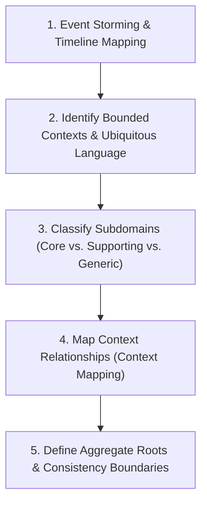
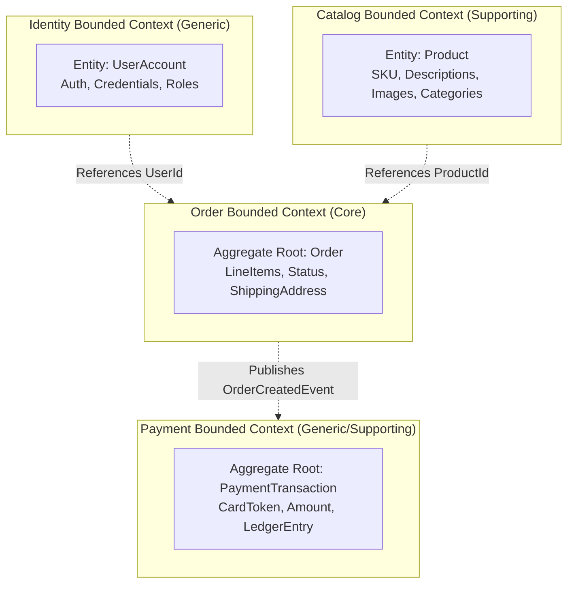

# 09 — Domain Decomposition & Boundary Modeling

## Purpose

Domain Decomposition is the architectural practice of partitioning a large, complex business problem space into discrete, cohesive, and loosely coupled subsystems using the principles of **Domain-Driven Design (DDD)**. 

It defines the boundaries of **Bounded Contexts, Core Domains, Supporting Domains, and Generic Subdomains**, ensuring that software architectures align cleanly with business capabilities and organizational team structures (Conway's Law).

---

## Problem It Solves

- **The Monolithic "God Entity"**: Prevents creating a single bloated `User` or `Order` object with 150 fields that every feature squad modifies, creating constant deployment conflicts.
- **Microservice Fragmentation**: Prevents carving microservices around database tables or technical layers (e.g., "User CRUD Service") rather than cohesive business capabilities.
- **Linguistic Ambiguity**: Resolves conflicting definitions of terms across departments (e.g., a "Customer" means a lead in Marketing, an account in Billing, and a delivery recipient in Shipping).

---

## Inputs

- **Business Capability Maps**: Enterprise Level 1 to Level 3 business capabilities.
- **Event Storming Workshop Outputs**: Timeline of domain events, commands, aggregates, and read models.
- **Organizational Structure**: Current engineering team topology and Conway's Law dynamics.
- **Functional Requirements**: Business workflows and state transitions from Step 03.

---

## Decision Process



---

## Subdomain Classification Framework

```mermaid
quadrantChart
    title Subdomain Strategic Portfolio
    x-axis Low Competitive Differentiation --> High Competitive Differentiation
    y-axis Low Complexity --> High Complexity
    quadrant-1 Core Domain (Invest Bespoke Engineering)
    quadrant-2 Supporting Subdomain (Custom build or customize)
    quadrant-3 Generic Subdomain (Buy SaaS / COTS)
    quadrant-4 Supporting Utility (Standard off-the-shelf)
```

1. **Core Domain**: The proprietary IP and unique business capability that gives the enterprise its competitive advantage (e.g., algorithmic pricing engine for an airline; matching engine for Uber). **Must be custom-built by elite in-house talent.**
2. **Supporting Domain**: Capabilities that complement the core domain but are not unique differentiators (e.g., inventory catalog management). Can be custom-built or outsourced.
3. **Generic Subdomain**: Standard commodity capabilities that exist in every business (e.g., identity authentication, billing invoicing, email notifications). **Must be bought off-the-shelf or consumed as SaaS (e.g., Auth0, Stripe, SendGrid).**

---

## Context Mapping Strategies

```mermaid
graph LR
    subgraph Upstream["Upstream Supplier (Sales Bounded Context)"]
        S1["Emits OrderSubmittedEvent"]
    end

    subgraph Downstream["Downstream Customer (Billing Bounded Context)"]
        B1["Consumes Event via ACL"]
    end

    Upstream -->|Context Map: Customer-Supplier with Anti-Corruption Layer (ACL)| Downstream
```

- **Shared Kernel**: Two bounded contexts share a small, tightly controlled common model.
- **Customer-Supplier**: Upstream team provides contracts; downstream team negotiates delivery.
- **Anti-Corruption Layer (ACL)**: Downstream context builds a translation adapter to shield its domain model from being polluted by upstream legacy schemas.
- **Separate Ways**: Contexts share zero integration; duplication is accepted to preserve total autonomy.

---

## Important Probing Questions

- *What is the specific Ubiquitous Language within this boundary?*
- *Can this domain model change without requiring database modifications in other domains?*
- *Does this boundary align with an autonomous Two-Pizza Team (6–8 engineers)?*
- *Are we attempting to force a single unified data model across two fundamentally different departments?*

---

## Key Metrics

- **Afferent / Efferent Coupling Ratio**: Incoming vs. outgoing dependencies between bounded contexts.
- **Aggregate Cohesion Index**: Degree to which data within an aggregate changes together under a single transaction.
- **Autonomous Release Frequency**: Ability of a domain team to deploy to production without cross-team sync.

---

## Common Mistakes

- **Decomposing by Technical Layer**: Creating a "Data Access Service", a "Business Logic Service", and a "UI Service". Boundaries must be vertical by business domain, not horizontal by layer.
- **Enormous Aggregates**: Placing 500 child entities inside an Aggregate Root, causing severe optimistic concurrency lock failures on concurrent updates.
- **Shared Database Anti-Pattern**: Allowing multiple bounded contexts to read and write to the exact same database tables.

---

## Concrete Example: E-Commerce Bounded Context Decomposition



*Notice*: The `Order` aggregate stores only `ProductId` and `UserId` as primitive value references—it does not hold direct object pointers to the `Product` or `User` objects.

---

## Trade-offs

| Strategy | Benefit | Trade-off / Cost |
|:---|:---|:---|
| **Fine-Grained Contexts** | Maximum team autonomy; independent deployment cadences. | Higher distributed integration overhead; eventual consistency latency. |
| **Coarse-Grained Contexts** | Immediate ACID consistency; simpler mental model; easier queries. | Larger codebase; potential deployment coordination bottlenecks. |

---

## Production Considerations

- Enforce domain boundaries using **Modular Monolith packages** initially; extract into microservices only when organizational scale demands it.
- Use automated **Architecture Fitness Functions (ArchUnit)** to fail builds if boundary leaks occur.
