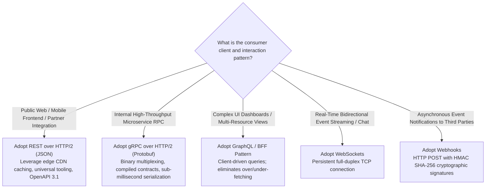

# 10 — API & Interaction Model Design

## Purpose

API and Interaction Model Design is the architectural discipline of defining explicit, strongly typed, secure, and backwards-compatible contracts for communication between clients, backend services, and external third-party systems.

In distributed systems, APIs represent **immutable public commitments**. Once published, modifying an API contract without breaking downstream mobile applications, frontend portals, or enterprise partner integrations is extraordinarily difficult.

---

## Problem It Solves

- **Contract Drift & Runtime Breakages**: Prevents unexpected null-pointer exceptions caused by teams silently modifying JSON fields without schema validation.
- **Over-Fetching & Under-Fetching**: Optimizes network payloads for bandwidth-constrained mobile devices.
- **Cascading Inefficiency**: Prevents "chatty" network interactions where loading a single user screen requires making 25 sequential REST calls.

---

## Inputs

- **Domain Model & Bounded Contexts**: Aggregates, commands, and queries from Step 09.
- **User Personas & Devices**: Web browsers, native mobile apps (iOS/Android), IoT sensors, B2B partner servers.
- **Performance & Latency Budgets**: Network payload constraints from Step 04 and Step 07.

---

## Decision Process: Protocol Selection Matrix



---

## Production API Design Standards

### 1. RESTful URI Conventions
- **Nouns over Verbs**: `/v1/orders` (Valid) vs. `/v1/createOrder` (Anti-pattern).
- **Plural Resources**: `/v1/users/{user_id}/payment-methods`.
- **Sub-Resource Nesting**: Maximum 2 levels deep to prevent unwieldy URIs (`/v1/tenants/{t_id}/projects/{p_id}/deployments`).

### 2. Standardized HTTP Verbs & Status Codes
- `GET`: Safe, idempotent retrieval. Returns `200 OK`.
- `POST`: Non-idempotent creation or command execution. Returns `201 Created` with `Location` header.
- `PUT`: Idempotent full replacement of resource. Returns `200 OK` or `204 No Content`.
- `PATCH`: Partial field update. Returns `200 OK`.
- `DELETE`: Idempotent deletion. Returns `204 No Content`.
- `400 Bad Request`: Validation failure (syntax error).
- `401 Unauthorized`: Missing or invalid authentication token.
- `403 Forbidden`: Authenticated caller lacks RBAC/ABAC authorization.
- `404 Not Found`: Resource does not exist.
- `409 Conflict`: State conflict (e.g., duplicate unique key or optimistic lock failure).
- `422 Unprocessable Entity`: Semantic business validation failure.
- `429 Too Many Requests`: Rate limit breached (`Retry-After` header included).

---

## Cursor-Based Pagination for High-Scale Endpoints

Never use offset-based pagination (`LIMIT 20 OFFSET 10000`) for datasets exceeding 10,000 records. As offset increases, relational engines must scan and discard thousands of rows ($O(N)$), degrading database CPU. 

**Standardize on Keyset / Cursor-Based Pagination ($O(1)$)**:

```http
GET /v1/orders?cursor=eyJpZCI6OTkwMSwidGltZSI6MTcyNTU4NTUwfQ==&limit=20
```

```sql
-- Evaluates via index lookup directly
SELECT * FROM orders 
WHERE (created_at, id) < ('2026-09-05 09:30:00', 'ord_9901')
ORDER BY created_at DESC, id DESC 
LIMIT 20;
```

---

## Idempotency Keys on Mutating Endpoints

To prevent duplicate financial charges during network timeouts, mutating endpoints (`POST /v1/payments`) must enforce client-supplied idempotency keys:

```mermaid
sequenceDiagram
    autonumber
    participant Client
    participant GW as API Gateway
    participant Redis as Idempotency Store
    participant Service as Payment Service

    Client->>GW: POST /v1/payments (Header: Idempotency-Key: 8a7c-42b1)
    GW->>Redis: SET payment_key:8a7c-42b1 "PROCESSING" NX EX 120
    alt Key did NOT exist (First execution)
        GW->>Service: Execute Payment Logic
        Service-->>GW: Payment Successful ($100, ID: pay_402)
        GW->>Redis: SET payment_key:8a7c-42b1 "COMPLETED:{status:201, payload:...}"
        GW-->>Client: 201 Created (Payment Complete)
    else Key ALREADY exists (Network retry after timeout)
        Redis-->>GW: Return Cached Response ("COMPLETED:{status:201, ...}")
        GW-->>Client: 201 Created (Returns Cached Result; ZERO Re-execution!)
    end
```

---

## Standardized Error Modeling: RFC 7807

Never return inconsistent custom JSON error payloads. Enforce **RFC 7807 (Problem Details for HTTP APIs)**:

```json
{
  "type": "https://api.enterprise.com/errors/card-declined",
  "title": "Payment Card Declined",
  "status": 402,
  "detail": "The issuing bank declined the transaction due to insufficient funds.",
  "instance": "/v1/payments/pay_98214",
  "invalid_params": [
    {
      "name": "card_cvv",
      "reason": "Invalid security code format"
    }
  ],
  "trace_id": "00-4bf92f3577b34da6a3ce929d0e0e4736-00f067aa0ba902b7-01"
}
```

---

## Important Probing Questions

- *Are public APIs versioned via URI path (`/v1/`), query parameter, or custom media type header?*
- *How do we ensure that internal breaking changes in gRPC Protobuf files are detected during CI?*
- *What is the maximum payload size allowed at the API Gateway before returning `413 Payload Too Large`?*
- *Does the API support client-driven field filtering (`?fields=id,status,total`) to reduce egress bandwidth?*

---

## Common Mistakes

- **Leaking Database Entities Directly into APIs**: Exposing raw ORM entities (Hibernate/EF Core models) directly to clients, causing accidental leaks of internal password hashes or breaking clients on table schema changes.
- **Using HTTP GET for State Mutations**: Placing actions in GET requests (e.g., `GET /v1/delete-user?id=12`), allowing web crawlers to accidentally delete user accounts.
- **Missing Rate Limiting Headers**: Failing to return `X-RateLimit-Limit`, `X-RateLimit-Remaining`, and `Retry-After` headers.

---

## Trade-offs

| API Paradigm | Benefit | Trade-off / Cost |
|:---|:---|:---|
| **REST (JSON)** | Universal browser compatibility; excellent edge caching tooling. | Verbose payloads; higher CPU serialization overhead; prone to over-fetching. |
| **gRPC (Protobuf)** | Compact binary size; 7x faster serialization; strictly typed contracts. | Incompatible with direct browser calls without proxies; harder to debug payloads via curl. |
| **GraphQL** | Client controls data fetching; single endpoint aggregates multiple services. | Complex caching (bypasses HTTP cache); vulnerable to malicious recursive query attacks. |

---

## Production Considerations

- Automate backwards-compatibility checking in CI pipelines using tools like **`buf breaking`** for Protobuf and **`openapi-diff`** for OpenAPI specs.
- Mandate **Backend-for-Frontend (BFF)** layers for specialized mobile experiences to prevent mobile network chattiness.
