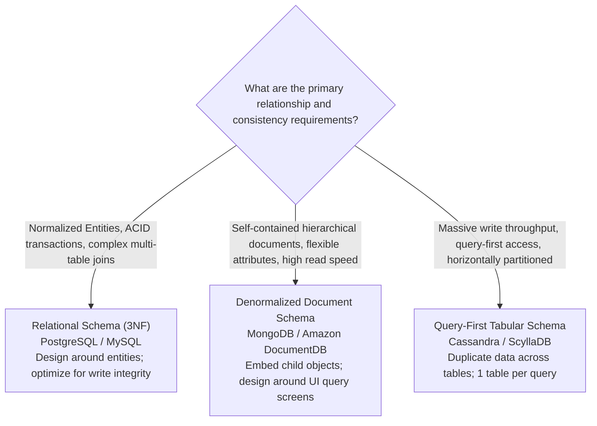
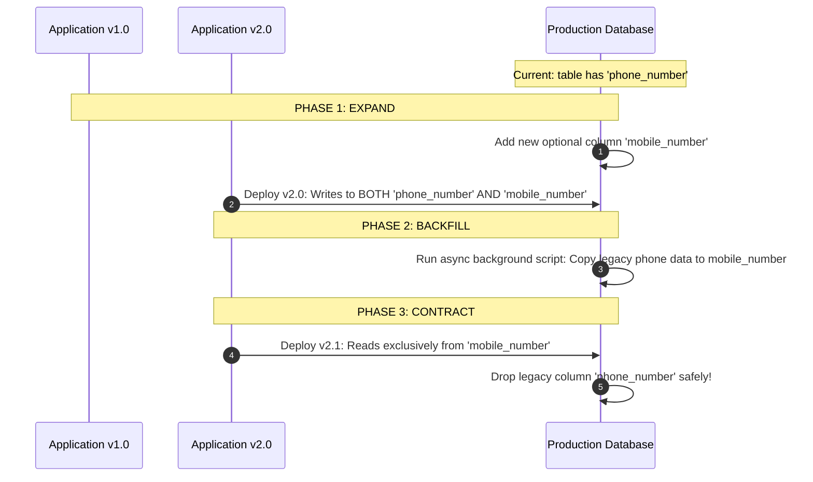

# 11 — Data Modeling & Schema Architecture

## Purpose

Data Modeling is the engineering discipline of structuring entities, attributes, relationships, constraints, and validation rules into a coherent schema that reflects the business domain while optimizing for storage efficiency, transactional consistency, and query performance.

In distributed systems, data outlives application code. Software frameworks and languages are rewritten every 3 to 5 years, but the underlying database schema and historical records persist for decades.

---

## Problem It Solves

- **Data Corruption & Integrity Failures**: Prevents race conditions and dirty states by enforcing database-level integrity constraints (`FOREIGN KEY`, `CHECK`, `UNIQUE`) rather than relying solely on fragile application code.
- **Query Saturation & Table Locks**: Prevents building unindexed or heavily circular relational schemas that cause full table scans and deadlocks under concurrency.
- **Costly Schema Migrations**: Avoids breaking production systems during releases through forward-compatible, evolutionary schema designs.

---

## Inputs

- **Domain Model & Aggregates**: Core entities, value objects, and lifecycle states from Step 09.
- **Scale Projections**: Projected record counts, storage sizes, and growth rates from Step 07.
- **Data Access Patterns**: Frequency of reads vs. writes, point lookups vs. range queries from Step 06.

---

## Decision Process: Relational vs. Document vs. Wide-Column Modeling



---

## 1. Relational Data Modeling (Normalized / 3NF)

### Golden Rules of Relational Schema Design
1. **Enforce Database-Level Constraints**: Never rely solely on application code to validate business invariants. Use native database constraints:
   ```sql
   CREATE TABLE accounts (
       id UUID PRIMARY KEY DEFAULT gen_random_uuid(),
       account_number VARCHAR(32) NOT NULL UNIQUE,
       balance NUMERIC(18, 4) NOT NULL DEFAULT 0.0000,
       status VARCHAR(20) NOT NULL,
       created_at TIMESTAMPTZ NOT NULL DEFAULT NOW(),
       CONSTRAINT chk_positive_balance CHECK (balance >= 0.0000),
       CONSTRAINT chk_valid_status CHECK (status IN ('ACTIVE', 'FROZEN', 'CLOSED'))
   );
   ```
2. **Surrogate vs. Natural Keys**: Standardize on surrogate UUIDv7 or auto-incrementing 64-bit integers (`BIGINT` / Snowflake IDs) for primary keys. Natural keys (e.g., email address, SSN) change over time and make foreign key cascades expensive.
3. **Avoid NULL-heavy EAV Anti-Patterns**: Do not create Entity-Attribute-Value (EAV) tables for dynamic product attributes. Use PostgreSQL `JSONB` with GIN indexing for polymorphic attributes instead.

---

## 2. NoSQL Data Modeling (Denormalized & Query-First)

In distributed NoSQL systems (DynamoDB, Cassandra), **you cannot perform relational `JOIN`s across distributed nodes**. Therefore, data modeling is **Query-Driven**:


### DynamoDB Single-Table Design Example
Instead of creating 10 separate tables, combine related entities into a single table partitioned by composite keys (`PK` and `SK`):

| Partition Key (`PK`) | Sort Key (`SK`) | Attributes / Data Payload |
|:---|:---|:---|
| `USER#usr_102` | `METADATA` | `{ "name": "Alice Smith", "email": "alice@corp.com" }` |
| `USER#usr_102` | `ORDER#2026-09-01#ord_9901`| `{ "total": 149.50, "status": "DELIVERED" }` |
| `USER#usr_102` | `ORDER#2026-09-05#ord_9942`| `{ "total": 35.00, "status": "PROCESSING" }` |

*Result*: A single query `WHERE PK = 'USER#usr_102'` retrieves both the user profile and their entire order history in a **single, sub-10ms network round-trip** with zero SQL joins!

---

## Evolutionary Database Schema Migrations: Expand and Contract

Never perform a breaking schema modification in production (e.g., renaming a column or dropping a field) in a single deployment. Apply the **Expand-and-Contract (Parallel Run) Pattern**:



---

## Important Probing Questions

- *What are the most frequent write transactions, and what locks will they acquire?*
- *How are historical modifications tracked? Are we using audit history tables or event sourcing?*
- *What is the database indexing strategy? Are we creating covering indexes for high-frequency queries?*
- *How will large multi-gigabyte tables be partitioned over a 3-year horizon?*

---

## Common Mistakes

- **Missing Foreign Key Indexes**: Forgetting to index foreign key columns in relational databases, causing full table scans and deadlocks during parent record deletes.
- **Over-Indexing**: Creating 15 indexes on a single table, degrading write throughput by 4x due to constant B-Tree rebalancing.
- **Using UUIDv4 as Primary Keys in B-Trees**: Random UUIDv4 strings cause severe B-Tree page fragmentation and cache thrashing. Use **UUIDv7** (time-ordered) or sequential Snowflake IDs instead.

---

## Trade-offs

| Strategy | Benefit | Trade-off / Cost |
|:---|:---|:---|
| **Normalized Schema (3NF)** | Zero data redundancy; maximum update consistency. | Complex multi-table JOINs; slower read performance at scale. |
| **Denormalized Schema (NoSQL)**| Lightning-fast single-round-trip reads ($O(1)$). | Data duplication; updating an entity requires mutating multiple documents. |

---

## Production Considerations

- Manage all database schema definitions as code using migration frameworks (**Flyway, Liquibase, EF Core Migrations**).
- Automate migration verification in CI/CD pipelines, verifying that migration scripts execute cleanly against a fresh staging replica before deployment.
